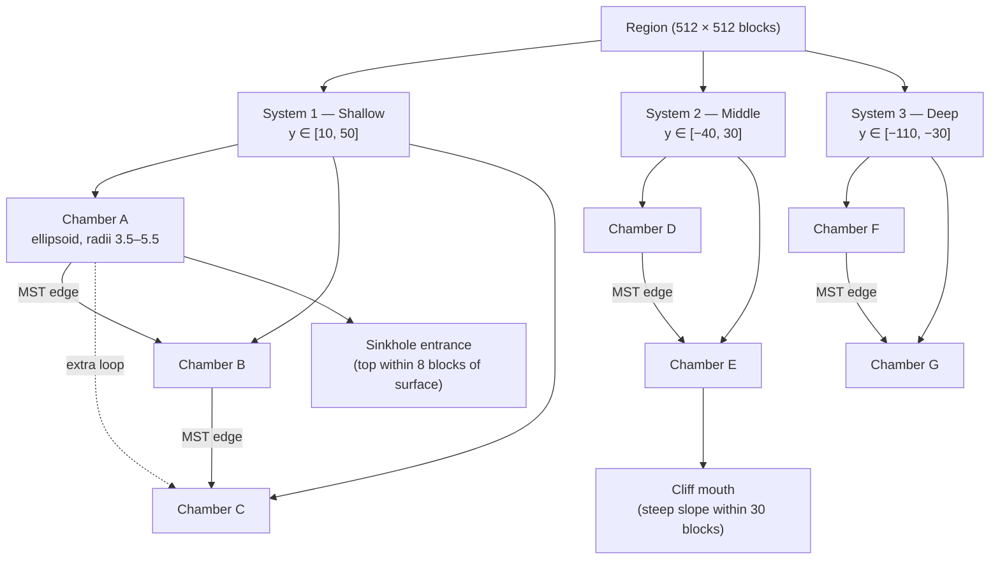

Caves built purely from 3D noise famously feel like Swiss cheese — every tunnel leads somewhere indistinguishable from somewhere else, every chamber is arbitrarily shaped, there's no reason to explore because there's nothing to find. The engine avoids this by generating each cave as an explicit graph: a set of chambers placed by Poisson-disk sampling, connected by a minimum spanning tree with a handful of extra loops, with spline tunnels in between and up to three kinds of surface entrance punching through. The result is a cave you can map in your head: "the big room, the two passages off it, the one that goes up to daylight."

The carving math — how that graph becomes voxels — lives in chapter [4.3](../part-4-chunk-fill/4.3-composing-caves.mdx). This chapter is about *which* chambers, *where*, and *how they connect*.

## The picture

Caves are inherently three-dimensional, so no single map view captures them. The structure is easier to read as a graph:



Each system lives in one of three depth bands. Chambers become air ellipsoids at carve time; the lines between them are spline tunnels. Surface entrance features punch through the terrain above.

## Build it — system rolling per region

`build_systems_for_region` is called once per `FineRegion` during region setup:

```rust
// src/worldgen/caves.rs
pub fn build_systems_for_region(
    seed: u64, coord: RegionCoord, heightmap: &HeightmapNoise, ...
    region: &mut FineRegion,
) {
    let n = CAVE_SYSTEMS_PER_REGION.0
        + mix_u32(seed, &[coord.x, coord.z, 1])
            % (CAVE_SYSTEMS_PER_REGION.1 - CAVE_SYSTEMS_PER_REGION.0 + 1);
    region.cave_systems.clear();
    for system_idx in 0..n as i32 {
        let sys = build_system(seed, coord, system_idx, heightmap, ...);
        region.cave_systems.push(sys);
    }
}
```

The count is a deterministic hash of `(seed, coord)`, so the same region always produces the same number of systems at the same positions regardless of load order. With `CAVE_SYSTEMS_PER_REGION = (1, 3)` you get 1–3 systems; the default is currently `(0, 0)` while the engine's procedural carver handles primary structural caves — see the tuning comment. Flipping it back to `(1, 3)` re-enables graph caves alongside the carver.

For each system, `build_system` picks a **depth band**:

| Band | Y range | Entrance probability |
|------|---------|---------------------|
| Shallow | y ∈ [10, 50] | 70% |
| Middle | y ∈ [−40, 30] | 25% |
| Deep | y ∈ [−110, −30] | 5% |

The pick is a three-way hash roll: 35% Shallow, 35% Middle, 30% Deep. A system's bounding box is then placed randomly within the region at the chosen depth range — up to 220 blocks wide in XZ and up to 64 blocks tall in Y — and the box is allowed to straddle region boundaries. Neighbours consult each other's systems via the 3 × 3 region neighbourhood at chunk-fill time.

## Build it — Poisson-disk chamber placement

A Poisson-disk sample is a set of points such that no two points are closer than a minimum distance. The classic algorithm (Bridson 2007) maintains an "active" frontier: repeatedly pick a frontier point, try up to ~30 candidates in an annulus at distance `[min_dist, 2 × min_dist]`, accept any candidate that clears all existing points, and retire the frontier point when all candidates fail.

The engine uses a lighter rejection-sampling variant: generate random candidate centers inside the system bounding box, and reject any that are too close to an already-accepted chamber. It makes at most 200 attempts to fill the requested `CHAMBERS_PER_SYSTEM` count. In practice this almost always succeeds because 2–4 chambers fit easily inside a 220-block bounding box.

The minimum spacing for a candidate is:

```
min_spacing = mean(rx, ry, rz) × POISSON_MIN_SPACING_MULT
            = mean(rx, ry, rz) × 3.0
```

where `rx`, `ry`, `rz` are the candidate's own ellipsoid radii (each independently drawn from `CHAMBER_RADIUS_RANGE = (3.5, 5.5)` blocks). A chamber with mean radius 4.5 blocks therefore needs at least 13.5 blocks of clear space from every other chamber center — enough that the ellipsoids don't overlap and don't bunch.

Each accepted candidate becomes a `Chamber`:

```rust
// src/worldgen/region.rs
pub struct Chamber {
    pub center: Vec3,  // world-space center
    pub radii:  Vec3,  // independent semi-axes (rx, ry, rz)
}
```

The three radii being independent is what makes chambers look geological rather than perfectly round: a chamber might be wide and flat, or tall and narrow, or roughly spherical.

## Build it — MST and extra loops

With chambers placed, the engine builds a `Tunnel` graph using Kruskal's algorithm:

1. Compute all pairwise Euclidean distances between chamber centers.
2. Sort edges by distance and add each edge that connects two previously disconnected components (union-find). This produces the minimum spanning tree — the smallest total edge length that connects all chambers.
3. Optionally add `MST_EXTRA_LOOPS` extra edges beyond the tree. The engine picks the shortest non-tree edges (`mix_u32` picks a random count in `(1, 2)`). These extra edges create cycles: multi-path navigation between chambers, "inner junction" rooms that serve as landmarks.

A 4-chamber system produces 3 MST edges + 1–2 loop edges = 4–5 total tunnels. A 2-chamber system (the minimum) produces 1 MST edge + 1–2 loops — a short double-passage between two rooms, which still reads clearly as a connected space.

## Build it — spline tunnels

Each edge in the tunnel graph becomes a `Tunnel`:

```rust
// src/worldgen/region.rs
pub struct Tunnel {
    pub control_points: Vec<Vec3>,  // 4 points: pa, p1, p2, pb
    pub radius: f32,                // cross-section in blocks
}
```

The tunnel radius is drawn uniformly from `TUNNEL_RADIUS = (2.0, 3.0)` blocks — a 4–6 block-wide corridor, walkable and readable.

The control-point layout is the key to making tunnels feel non-straight:

1. Start at chamber center `pa`, end at chamber center `pb`.
2. Find two perpendicular axes to the `pa → pb` direction.
3. Place intermediate control points at 33% and 66% along the segment, then push each one perpendicular by an independent random offset drawn from `[−amp, +amp]` on both perpendicular axes:

```rust
// src/worldgen/caves.rs — build_system (tunnel construction)
let p1 = pa.lerp(pb, 0.33) + perp1 * off1_u + perp2 * off1_v;
let p2 = pa.lerp(pb, 0.66) + perp1 * off2_u + perp2 * off2_v;
tunnels.push(Tunnel { control_points: vec![pa, p1, p2, pb], radius });
```

The amplitude scales with tunnel radius: `amp = radius × (1.0..1.5) × 4.0`, so wider tunnels meander more. The perpendicular push is what bends tunnels into curves and arches — without it they'd be straight capsule bores. This is the same domain-warping principle as [1.6](../part-1-foundations/1.6-domain-warping.mdx), applied to the tunnel's own local coordinate system rather than to global heightmap coordinates.

The stored 4-point polyline is sampled at carve time as a sequence of straight capsule segments approximating a Catmull-Rom spline (see the comment in `region.rs`: "One tunnel — a Catmull-Rom spline through 2–4 control points"). The capsule SDF (chapter [1.8](../part-1-foundations/1.8-sdfs.mdx)) decides which voxels fall inside.

## Build it — surface entrances

After chambers are wired up, each chamber independently rolls for a surface entrance. The roll compares a `mix_unit` hash against the depth band's entrance probability (70% Shallow, 25% Middle, 5% Deep). About 70% of shallow chambers try to break to surface; almost none of the deep ones do.

If a chamber rolls to seek a surface, three entrance types are evaluated in order:

**1. Sinkhole.** The chamber's top (`center.y + radii.y`) must be within `SINKHOLE_DEPTH_MAX = 8` blocks of `h_pre` directly above. When this test passes, the engine records a vertical shaft from the chamber top to the surface — the simplest entrance, a hole in the ground. Used for shallow chambers that nearly reach the surface.

**2. Cliff mouth.** The engine samples 16 directions around the chamber at radius `CLIFF_ENTRANCE_DIST = 30` blocks. If any sample lands on a column flagged as a cliff by `heightmap.is_cliff(...)`, a `CliffMouth` entrance is recorded at that point. The shaft exits horizontally through the cliff face. This is evaluated when a sinkhole isn't geometrically possible — the chamber is too far below the terrain above it, but happens to sit near a cliff face.

**3. Skylight.** If the gap between the chamber top and `h_pre` is between 30 and 60 blocks, a narrow shaft is recorded. Skylights are 1–2 blocks wide — barely walkable — and mostly aesthetic: they let a column of light reach deep into a chamber, giving a "cathedral" feel without requiring the chamber to be near the surface.

If none of the three tests passes — the chamber is deep, not near a cliff, and the gap to surface is outside both the sinkhole and skylight windows — the chamber stays buried with no natural opening. Players can still find it by digging.

The result is stored in `FineRegion::cave_systems` as a `CaveSystem`:

```rust
// src/worldgen/region.rs
pub struct CaveSystem {
    pub bb_min: IVec3,
    pub bb_max: IVec3,
    pub chambers:  Vec<Chamber>,
    pub tunnels:   Vec<Tunnel>,
    pub entrances: Vec<Entrance>,
}

pub struct Entrance {
    pub chamber_idx: u32,
    pub kind:        EntranceKind,
    pub surface:     IVec3,  // anchor point in world space
}

pub enum EntranceKind { Sinkhole, CliffMouth, Skylight }
```

The `bb_min` / `bb_max` bounding box is expanded to include all chamber ellipsoids, all tunnel control points padded by their radius, and all entrance shafts. At chunk-fill time, this AABB is the first intersection test — if the chunk doesn't overlap the box, the whole system is skipped with no per-voxel work.

## In the engine

`build_systems_for_region` runs during region setup. `FineRegion::cave_systems` is a `Vec<CaveSystem>` — typically 0–3 systems, each with 2–4 chambers and 3–6 tunnels.

At chunk time, `cave_sdf` and `entrance_air` iterate only over systems whose `bb_min/bb_max` intersects the chunk. For each system, chamber ellipsoids and tunnel capsules are evaluated per-voxel. Entrance features use a separate code path that bypasses `CAVE_SURFACE_BUFFER` — the normal guard that prevents accidental surface carving — so sinkhole shafts and skylights punch cleanly through even the topmost solid layer.

The actual composition of cave density with terrain density, and the exact SDF math for ellipsoids and capsules, is in chapter [4.3](../part-4-chunk-fill/4.3-composing-caves.mdx).

## Closing — wormholes

Below `WORMHOLE_BAND_Y = −40`, the engine layers in a separate `WormholeNoise` carver that runs independently of any system graph. `WormholeNoise` evaluates a multi-octave fBm field at each voxel and carves when the field value falls in a thin band near zero (`WORMHOLE_BAND = 0.05`). The result is a sparse network of narrow passages — "dig deep, occasionally break into something" — that supplements the explicit graph caves in the deep band.

These passages are not connected to any chamber or entrance; they're just open space. Their composition with the graph systems, and with the cheese-noise and spaghetti-noise carvers that the engine also runs, is the topic of chapter 4.3.

## What you can now do

Read `src/worldgen/caves.rs`, specifically `build_system` (lines ~94–401) for the full chamber placement, MST, tunnel, and entrance logic. The struct definitions are in `src/worldgen/region.rs` starting at line 194.

Tuning levers in `src/worldgen/tuning.rs`:

- **`CAVE_SYSTEMS_PER_REGION = (0, 0)`** — flip to `(1, 3)` to enable graph cave systems alongside the procedural carver.
- **`CHAMBERS_PER_SYSTEM = (2, 4)`** — controls how many rooms each system has. Higher values create more complex graphs; lower values make tighter two- or three-room clusters.
- **`CHAMBER_RADIUS_RANGE = (3.5, 5.5)`** — semi-axis range for chamber ellipsoids. Raising both ends makes every room larger; widening the range creates more variety between small alcoves and large halls.
- **`POISSON_MIN_SPACING_MULT = 3.0`** — minimum spacing between chamber centers as a multiple of mean radius. Decreasing this allows chambers to pack more densely (or even partially overlap); increasing it enforces more spread.
- **`MST_EXTRA_LOOPS = (1, 2)`** — number of loop edges added beyond the MST. More loops mean more multi-path systems and fewer dead ends.
- **`TUNNEL_RADIUS = (2.0, 3.0)`** — cross-section of tunnels in blocks. Increasing this makes passages wide and roomy; decreasing creates tight crawls.
- **`ENTRANCE_PROB_SHALLOW / _MIDDLE / _DEEP = 0.70 / 0.25 / 0.05`** — probability that each chamber tries for a surface entrance. Lowering shallow caves to 0.3 makes entrances feel rarer and more discoverable.
- **`SINKHOLE_DEPTH_MAX = 8`** — maximum gap between chamber top and surface for a sinkhole. Increase to let deeper chambers also form vertical shafts.
- **`CLIFF_ENTRANCE_DIST = 30`** — search radius for cliff-face entrances. Increase to give mid-depth chambers more chances to find a cliff exit.

## Next

Part III is complete.

→ [Part IV — Per-Chunk Fill, starting with 4.1 Density Graph](../part-4-chunk-fill/4.1-density-graph.mdx)
