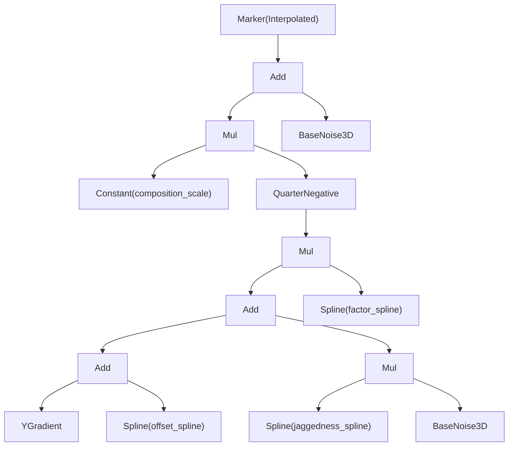

Part III produced per-region, per-column cached values — heightmaps, biome assignments, river paths. None of that runs per-voxel. What runs per-voxel is a single signed number: the **density**. Positive density means solid; negative means air. Everything the world contains at a given block coordinate ultimately reduces to a sign check on this number.

The engine authors that function as a small expression tree called `DensityFn` — a recursive enum of nodes, each one either a leaf (a raw value) or a combinator (an operation on its children). `build_default_tree` wires a specific tree from `ClimateConfig` and `DensityConfig`, and `fill_chunk` evaluates that tree at 9×9×9 cell corners per chunk before trilerping the rest. This chapter walks the tree from root to leaves and explains what each node contributes to the final density.

## The picture



The tree is wrapped in a `Marker(Interpolated, ...)` at the outermost level — the `CellEvaluator` uses this hint to sample the whole tree only at the 8 corners of each 4×4×4 cell and trilerp everything else. Chapter 4.2 covers the evaluator; here the focus is on the composition logic inside the marker.

## Build it — the leaf nodes

Every path through the tree eventually bottoms out at one of three kinds of leaves.

**`YGradient`** is the simplest and most important. It is a purely vertical ramp:

```rust
// src/worldgen/density_graph.rs — DensityFn::evaluate
DensityFn::YGradient => {
    let t = (wy - cfg.y_min) as f32 / (cfg.y_max - cfg.y_min) as f32;
    cfg.y_gradient_amplitude * (1.0 - 2.0 * t)
}
```

At `y_min` the gradient equals `+y_gradient_amplitude` (strongly solid). At `y_max` it equals `-y_gradient_amplitude` (strongly air). The mid-point of the world is zero. Most voxels sit far enough from the surface that their gradient alone decides whether they are solid or air; only a band of a few dozen blocks near the terrain surface is genuinely contested.

**`BaseNoise3D`** delegates to `DensityNoise::evaluate_base_3d` — a 3-octave Simplex FBM seeded at `seed + 701`, configured by `base_3d_period`, `base_3d_amplitude`, and `base_3d_y_scale`. The Y-axis scale (`0.5` by default) stretches vertical features so overhangs and stalactites are taller than they are wide. The seed offset 701 is deliberately far from the climate-noise seeds (303, 404) so the two channels do not correlate; if they did, the `factor` spline's job of decoupling roughness from elevation would be undermined.

**`Spline`** evaluates a `NestedSpline` — the same three-channel recursive Hermite spline introduced in [3.3](../part-3-region-build/3.3-heightmap.mdx). The spline node receives the column's pre-computed `ColumnClimate` triple `(continentalness, terrain_shape, ridges_pv)` and evaluates to a single `f32` output. There are three spline leaves in the default tree: `offset_spline`, `factor_spline`, and `jaggedness_spline`.

## Build it — the composition passes

The default tree composes its leaves in four passes, each named after what it produces.

### Pass 1 — depth

```rust
let depth = DensityFn::Add(
    Box::new(DensityFn::YGradient),
    Box::new(DensityFn::Spline { spline: offset }),
);
```

`depth = y_gradient + offset_spline`. The `offset_spline` is the dominant terrain-shaping signal from [3.3](../part-3-region-build/3.3-heightmap.mdx): high on continental plateaus, negative beneath ocean floors. Adding it to `YGradient` shifts the gradient's zero-crossing up or down — this is where the terrain surface actually lives. Deep underground, `y_gradient` is so large that `offset` barely matters; near the surface they are comparable; high in the sky, `offset` cannot overcome the negative gradient.

### Pass 2 — jagged rider

```rust
let jagged_rider = DensityFn::Mul(
    Box::new(DensityFn::Spline { spline: jaggedness }),
    Box::new(DensityFn::BaseNoise3D),
);
```

`jagged_rider = jaggedness_spline * base_3d`. The `jaggedness_spline` keys on all three climate axes and returns a scalar near zero on beaches and plains, rising toward 1 on mountain ridges. Multiplying by `BaseNoise3D` means the 3D FBM only *injects roughness where the terrain is authored to be rough*. This is what prevents flat plains from sprouting accidental stalagmites.

### Pass 3 — shape and soften

```rust
let shaped_raw = DensityFn::Mul(
    Box::new(DensityFn::Add(Box::new(depth), Box::new(jagged_rider))),
    Box::new(DensityFn::Spline { spline: factor }),
);
let shaped = DensityFn::QuarterNegative(Box::new(shaped_raw));
```

`shaped_raw = (depth + jagged_rider) * factor_spline`.

The `factor_spline` is a roughness multiplier: mountainous regions receive a high factor so the surface transition is steep and dramatic; flat ocean floors receive a low factor so the transition is gentle and unbroken. After scaling, `QuarterNegative` applies asymmetric softening:

```rust
DensityFn::QuarterNegative(inner) => {
    let v = inner.evaluate(wx, wy, wz, climate, density, cfg);
    if v > 0.0 { v } else { v * cfg.above_surface_softening }
}
```

Positive values (below the surface, would-be solid) pass through unchanged. Negative values (above the surface, would-be air) are multiplied by `above_surface_softening` — 0.25 by default, matching Minecraft's `quarter_negative` convention. This compression is what allows overhangs to form: the solid side of the surface has full density strength; the air side is pulled toward zero, so a small positive perturbation from `base_3d` can flip a voxel to solid even slightly above the nominal surface.

### Pass 4 — compose with base_3d

```rust
let scaled = DensityFn::Mul(
    Box::new(DensityFn::Constant(density_cfg.composition_scale)),
    Box::new(shaped),
);
let composed = DensityFn::Add(Box::new(scaled), Box::new(DensityFn::BaseNoise3D));
```

`density = composition_scale * shaped + base_3d`.

The `composition_scale` constant (4.0 by default) amplifies the shaped signal before the final addition. Then a second, independent sample of `BaseNoise3D` is added. This second pass contributes fine surface texture — thin stalactites, pock-marked cliff faces — that the cell-interpolated shaped signal at 4-block resolution would miss. Because `base_3d` is added *after* `composition_scale`, it punches through at full amplitude regardless of how the shaped term was scaled.

The full composition, written as one expression:

```text
shaped     = (y_gradient + offset_spline + jaggedness_spline * base_3d) * factor_spline
shaped'    = quarter_negative(shaped)
density    = composition_scale * shaped' + base_3d
```

## In the engine

`fill_chunk` builds the tree once at the top of each chunk, after snapshotting the live config:

```rust
// src/worldgen/mod.rs — Generator::fill_chunk (abridged)
let cfg = self.config_snapshot();
let graph = density_graph::build_default_tree(&cfg.climate, &cfg.density);
```

The tree is stateless — it holds only `Arc` pointers to the splines from `cfg.climate` and the single `Constant` node from `cfg.density.composition_scale`. Building it is cheap (a handful of `Box` allocations). Because it is built fresh each chunk, a config hot-reload takes effect on the next chunk that starts filling — no generator restart is needed.

`build_default_tree` is not the only possible tree; the engine's `DensityFn` enum supports `Min`, `Max`, and `Marker` wrappers that are not used by the default composition. Future biome-specific subtrees could be wired in by replacing or extending the call site.

## The slide function

Caves, aquifers, and the base composition can all produce unusual density values near the world's vertical boundaries. `slide` is a post-evaluation clamp applied in the chunk loop *after* the cell evaluator returns its interpolated value:

```rust
// src/worldgen/heightmap.rs
pub fn slide(density: f32, wy: i32, cfg: &DensityConfig) -> f32 {
    if wy < cfg.y_min {
        return 100.0; // hard void floor — unoverridable solid
    }
    // Top: within slide_top_blocks of y_max, lerp toward slide_top_target (< 0).
    // Bottom: within slide_bottom_blocks of y_min, lerp toward slide_bottom_target (> 0).
    // ...
}
```

Near `y_max`, density is smoothly lerped toward a small negative value (`slide_top_target`), guaranteeing that the sky limit is always air. Near `y_min`, density is lerped toward a small positive value (`slide_bottom_target`), guaranteeing a solid void floor. The lerp width (`slide_top_blocks`, `slide_bottom_blocks`) is tunable; without it, extreme 3D noise values could produce floating carpets at the sky limit or water-filled voids below the deepest cave floor.

`slide` is deliberately excluded from the tree and not interpolated per cell. Its effect varies strongly per block-Y (the lerp factor changes by `1/slide_top_blocks` per block), so interpolating it at 4-block granularity would produce visible density discontinuities at chunk boundaries. Running it per-voxel is cheap because it is four arithmetic operations with no noise sampling.

## What you can now do

Read `src/worldgen/density_graph.rs` end to end — the full file is around 400 lines including `CellEvaluator` and the unit tests. Then read `src/worldgen/heightmap.rs`'s `DensityNoise::evaluate` alongside it to see the original scalar implementation that the tree now matches exactly.

To change global density character, edit the knob tables in `assets/worldgen/default.ron` under the `density:` section. No recompilation is needed:

- Increase `composition_scale` (default 4.0) to make the surface transition sharper everywhere.
- Decrease `above_surface_softening` (default 0.25) toward 0 to suppress all overhangs — the air side of the surface gets no positive perturbation from `base_3d`.
- Adjust `base_3d_amplitude` to control how much fine-surface texture bleeds through the final `+ base_3d` pass.

The three splines (`offset_spline`, `factor_spline`, `jaggedness_spline`) are the same ones that drive `h_pre` in [3.3](../part-3-region-build/3.3-heightmap.mdx) — changes there affect both the heightmap and the density tree simultaneously.

## Next

→ [4.2 The Cell Evaluator](./4.2-cell-evaluator.mdx) — how `CellEvaluator` samples the tree at 729 corners per chunk and trilerps the interior voxels for a ~134× speedup on the per-voxel hot path.
