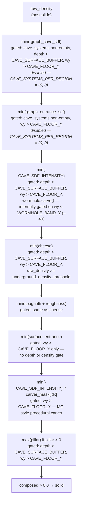

Caves do not write `Block::Air` directly into a voxel buffer. They modulate the *density field* — pulling a positive density down through zero. The threshold check `composed > 0.0` that follows the composition block is the only place a voxel transitions from solid to air. Everything downstream — surface rules, aquifers, fluid settle — sees a coherent signed density value at every coordinate.

The composition rules are deliberately simple: `min(composed, -intensity)` to carve, `max(composed, refill)` to refill. All of the complexity lives in *what each layer contributes* and *under what conditions it fires*. This chapter traces the eight layers that `fill_chunk` applies in order, from the post-slide `raw_density` to the final sign check.

## The picture

Each layer is a `min` or `max` applied to `composed`. A layer that is gated but whose gate is not met silently leaves `composed` unchanged.



## Build it — the gates

Three boolean conditions act as guards throughout the composition block. Understanding them upfront makes each layer's gate trivial to read.

**`wy > CAVE_FLOOR_Y`** (`CAVE_FLOOR_Y = -120`) is the simplest: a hard lower bound in world Y. Nothing carves below Y = −120, so the deepest part of the loaded chunk stack stays solid. It appears on every layer — it is always present.

**`approx_depth > CAVE_SURFACE_BUFFER`** (`CAVE_SURFACE_BUFFER = -1`) is a depth-below-heightmap check. `approx_depth` is the current voxel's distance below the column's estimated surface height. With the buffer set to −1, the condition is true whenever `approx_depth > -1`, i.e., depth ≥ 0 — which means *even the topmost solid block* of a column satisfies it. The comment in `tuning.rs` is explicit: this value is deliberately permissive, allowing tubes to punch through to the surface and form visible cave openings. Raising it to a positive value (e.g., 4) would insulate the top few solid layers from most carvers.

**`raw_density >= cfg.cave.underground_density_threshold`** (`underground_density_threshold = 0.0` in `assets/worldgen/default.ron`) restricts noise carvers to voxels that are already comfortably solid. A voxel right at the density surface has `raw_density ≈ 0`; deep underground it is large and positive. By requiring `raw_density >= 0.0`, the engine ensures that spaghetti and cheese noise only run where there is solid rock to carve — the surface band, where densities hover near zero, is protected. The surface entrance layer deliberately skips this gate, which is what lets it punch holes through into the heightmap.

## Build it — the layers

### 1 & 2. Graph cave and entrance SDFs (disabled)

```rust
// src/worldgen/mod.rs — fill_chunk (abridged)
if !cave_systems.is_empty() && wy > CAVE_FLOOR_Y {
    if approx_depth > CAVE_SURFACE_BUFFER {
        let sdf = caves::cave_sdf(wx, wy, wz, &cave_systems);
        if sdf > 0.0 {
            composed = composed.min(-sdf);
        }
    }
    let ent = caves::entrance_sdf(wx, wy, wz, &cave_systems);
    if ent > 0.0 {
        composed = composed.min(-ent);
    }
}
```

`cave_sdf` and `entrance_sdf` query the graph cave system built in [3.6](../part-3-region-build/3.6-cave-systems.mdx). The graph cave SDF represents the interior of the chamber-and-tunnel network; the entrance SDF represents the deliberate surface openings attached to each chamber. They are handled separately because their surface-buffer gates differ: the graph cave SDF respects `CAVE_SURFACE_BUFFER` (stays away from the topmost blocks), while the entrance SDF does not, so it can carve directly through the surface into a chamber below.

Both layers are currently dead code. `CAVE_SYSTEMS_PER_REGION = (0, 0)` in `tuning.rs` means `cave_systems` is always empty, and the outer guard `!cave_systems.is_empty()` is never satisfied. The layered structure is preserved in full so that re-enabling graph caves requires only changing that one constant. See [3.6](../part-3-region-build/3.6-cave-systems.mdx) for the graph construction logic and [4.5](./4.5-procedural-carvers.mdx) for the currently-active carver.

### 3. Wormhole noise

```rust
if approx_depth > CAVE_SURFACE_BUFFER
    && wy > CAVE_FLOOR_Y
    && self.wormhole_noise.carve(wx, wy, wz)
{
    composed = composed.min(-CAVE_SDF_INTENSITY);
}
```

`WormholeNoise::carve` evaluates two independent 3D noise fields and returns true where both are near zero simultaneously — two zero-crossing sheets that intersect, producing a classic wormhole-shaped tunnel. Critically, `carve` contains its own internal gate: it returns false for any `wy >= WORMHOLE_BAND_Y` (`WORMHOLE_BAND_Y = -40`). Wormholes therefore operate only in the deep band below Y = −40, leaving the shallower cave volume cleaner.

When the gate fires, the density is pulled to `min(composed, -CAVE_SDF_INTENSITY)` — a hard push to −4.0. With the density tree typically producing values in [−2, +2], this guarantees a solid-to-air transition wherever a wormhole intersects.

### 4 & 5. Cheese and spaghetti (noise carvers)

```rust
if approx_depth > CAVE_SURFACE_BUFFER
    && wy > CAVE_FLOOR_Y
    && raw_density >= cfg.cave.underground_density_threshold
{
    let cheese = caves::cheese_contribution(
        wx, wy, wz, raw_density, &self.noise_carvers, &cfg.cave,
    );
    composed = composed.min(cheese);

    let spag = caves::spaghetti_contribution(wx, wy, wz, &self.noise_carvers, &cfg.cave);
    let roughness = caves::spaghetti_roughness(wx, wy, wz, &self.noise_carvers);
    composed = composed.min(spag + roughness);
}
```

These two layers implement Minecraft-style ambient noise caves. Cheese noise produces large, roughly spherical pockets (the "Swiss cheese" shape); spaghetti noise produces narrow, winding tubes. Both return signed density contributions — negative where they want to carve, positive or near-zero elsewhere. The `min` operation means they only affect the density when their own value is lower than what the composition has already reached.

The `underground_density_threshold` gate is what distinguishes these layers from the surface entrance below. Neither cheese nor spaghetti can carve in the surface band because `raw_density` there is near zero. They are silent precisely where the terrain is thin and carving would demolish the surface. Chapter [4.4](./4.4-noise-carvers.mdx) covers both functions in detail.

### 6. Surface entrance noise

```rust
if wy > CAVE_FLOOR_Y {
    let ent = caves::surface_entrance_contribution(
        wx, wy, wz, &self.noise_carvers, &cfg.cave,
    );
    composed = composed.min(ent);
}
```

The surface entrance layer carries only one gate: `wy > CAVE_FLOOR_Y`. No depth check, no density threshold. The deliberate omission of `raw_density >= underground_density_threshold` is what makes natural cave mouths possible — this carver operates exactly where cheese and spaghetti cannot, punching small holes through the heightmap to expose the cave volume below.

`surface_entrance_contribution` is a noise-gated, Y-windowed carver. It fires only within a configurable Y band (`surface_entrance_y_min` / `surface_entrance_y_max`) and applies a soft fade at each boundary to avoid abrupt cut-offs. Above the band and below it, the contribution is zero and `composed` passes through unchanged. Chapter [4.4](./4.4-noise-carvers.mdx) covers its implementation.

### 7. MC-style carver mask

```rust
if wy > CAVE_FLOOR_Y {
    let lx = (wx - origin.x) as usize;
    let ly = (wy - origin.y) as usize;
    let lz = (wz - origin.z) as usize;
    let idx = lx + dim * ly + dim * dim * lz;
    if carver_mask[idx] {
        composed = composed.min(-CAVE_SDF_INTENSITY);
    }
}
```

`carver_mask` is a `Vec<bool>` of length `dim³` built once per chunk by `build_carver_mask` before the voxel loop begins. Each element records whether a procedural MC-style carver — a carved ellipsoidal tube — passes through that voxel. When the mask is set, `composed` is hard-pushed to −4.0, guaranteed air. This is the active cave generator in the current build: `CAVE_SYSTEMS_PER_REGION = (0, 0)` leaves the graph layers inert, so the carver mask is what actually produces tunnels in the world today. Chapter [4.5](./4.5-procedural-carvers.mdx) covers how the mask is built.

### 8. Pillars (refill)

```rust
if approx_depth > CAVE_SURFACE_BUFFER && wy > CAVE_FLOOR_Y {
    let pillar = caves::pillar_contribution(
        wx, wy, wz, &self.noise_carvers, &cfg.cave,
    );
    if pillar > 0.0 {
        composed = composed.max(pillar);
    }
}
```

Pillars are the one layer that applies `max` rather than `min`. `pillar_contribution` returns a positive density value at certain underground voxels — rock columns that should remain solid even inside an otherwise-carved cave. The `max` operation means a pillar can pull a negative `composed` back up through zero, overriding the carving done by any earlier layer. The pillar gate does apply `approx_depth > CAVE_SURFACE_BUFFER`, so surface blocks are never refilled by the pillar system.

## In the engine

The full composition block, from `raw_density` to the sign check, occupies roughly eighty lines of `fill_chunk`:

```rust
// src/worldgen/mod.rs — Generator::fill_chunk (abridged)
let mut composed = raw_density;

// Graph carvers (cave SDF + entrance SDF) — currently no-op.
if !cave_systems.is_empty() && wy > CAVE_FLOOR_Y {
    if approx_depth > CAVE_SURFACE_BUFFER {
        let sdf = caves::cave_sdf(wx, wy, wz, &cave_systems);
        if sdf > 0.0 {
            composed = composed.min(-sdf);
        }
    }
    let ent = caves::entrance_sdf(wx, wy, wz, &cave_systems);
    if ent > 0.0 {
        composed = composed.min(-ent);
    }
}

// Wormhole — deep band only (internal gate: wy < WORMHOLE_BAND_Y = -40).
if approx_depth > CAVE_SURFACE_BUFFER
    && wy > CAVE_FLOOR_Y
    && self.wormhole_noise.carve(wx, wy, wz)
{
    composed = composed.min(-CAVE_SDF_INTENSITY);
}

// Noise carvers — gated by raw_density threshold.
if approx_depth > CAVE_SURFACE_BUFFER
    && wy > CAVE_FLOOR_Y
    && raw_density >= cfg.cave.underground_density_threshold
{
    let cheese = caves::cheese_contribution(wx, wy, wz, raw_density,
        &self.noise_carvers, &cfg.cave);
    composed = composed.min(cheese);

    let spag = caves::spaghetti_contribution(wx, wy, wz,
        &self.noise_carvers, &cfg.cave);
    let roughness = caves::spaghetti_roughness(wx, wy, wz, &self.noise_carvers);
    composed = composed.min(spag + roughness);
}

// Surface entrance — no density gate (carves through surface).
if wy > CAVE_FLOOR_Y {
    let ent = caves::surface_entrance_contribution(wx, wy, wz,
        &self.noise_carvers, &cfg.cave);
    composed = composed.min(ent);
}

// MC carver mask — active cave generator.
if wy > CAVE_FLOOR_Y && carver_mask[idx] {
    composed = composed.min(-CAVE_SDF_INTENSITY);
}

// Pillars — refill carved voxels where columns apply.
if approx_depth > CAVE_SURFACE_BUFFER && wy > CAVE_FLOOR_Y {
    let pillar = caves::pillar_contribution(wx, wy, wz,
        &self.noise_carvers, &cfg.cave);
    if pillar > 0.0 {
        composed = composed.max(pillar);
    }
}

let solid = composed > 0.0;
```

`composed > 0.0` is the only place a voxel becomes air. Everything after this point in `fill_chunk` — aquifer substance selection, flood-fill for ocean and lake surfaces, block-type assignment — receives a binary `solid` flag and the final `composed` value.

## The disabled graph layer

`CAVE_SYSTEMS_PER_REGION = (0, 0)` is set in `src/worldgen/tuning.rs`. It makes both `cave_sdf` and `entrance_sdf` unreachable: the outer guard `!cave_systems.is_empty()` is never satisfied because `generate_cave_systems` returns an empty `Vec` for every region. The only layers that actually carve in the current build are the wormhole (below Y = −40), the noise carvers (where `raw_density >= 0`), the surface entrance, and the MC-style carver mask.

This is an intentional holding pattern. The graph cave infrastructure from [3.6](../part-3-region-build/3.6-cave-systems.mdx) — chamber placement, spline tunnels, entrance geometry — is complete and tested in isolation. Re-enabling it requires setting `CAVE_SYSTEMS_PER_REGION` to something like `(1, 3)` and verifying that the noise carvers and graph caves compose sensibly in overlapping regions. The current MC carver mask ([4.5](./4.5-procedural-carvers.mdx)) provides a baseline of coherent tunnels while that integration work is pending.

## What you can now do

Read the composition block in `src/worldgen/mod.rs` starting at the line `let mut composed = raw_density;`. The layer order maps directly to this chapter. Then try these tuning levers — all in `assets/worldgen/default.ron` and `src/worldgen/tuning.rs`, no recompilation needed for the `.ron` values:

- **`cave.underground_density_threshold`** (default `0.0`): raise toward `0.5` to push cheese and spaghetti deeper, leaving a thicker buffer of intact rock below the surface. Lower below `0.0` to let noise carvers operate closer to the heightmap — expect more ragged surface terrain.
- **`CAVE_FLOOR_Y`** (default `−120`, requires recompilation): push deeper to extend caves toward bedrock; raise to eliminate deep cave generation entirely.
- **`CAVE_SURFACE_BUFFER`** (default `−1`, requires recompilation): raise to `4` or `8` to restore a conventional surface-protection buffer, preventing any carver (except surface entrance) from touching the top few solid layers of a column. The current value of −1 makes the surface intentionally carveable by all depth-gated layers.

## Next

→ [4.4 Noise Carvers](./4.4-noise-carvers.mdx) — the implementation of `cheese_contribution`, `spaghetti_contribution`, `spaghetti_roughness`, and `surface_entrance_contribution`: what noise functions they use, how the signed-density output is shaped, and the per-layer configuration knobs in `CaveConfig`.
