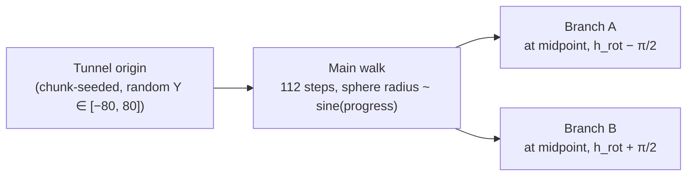

Chapter [3.6](../part-3-region-build/3.6-cave-systems.mdx) introduced an elaborate cave-system graph: chambers placed by Poisson-disk sampling, MST-connected tunnels, three types of surface entrance. It's a thoughtful design — and it's completely dormant. `CAVE_SYSTEMS_PER_REGION = (0, 0)` means the graph cave and graph entrance layers in [4.3](./4.3-composing-caves.mdx) are never triggered. The caves you actually walk through in-game come from this chapter instead: the MC-style procedural carver.

It takes a different approach. There is no global graph, no chamber placement, no MST. Each chunk independently seeds its own winding tunnels using a deterministic hash of `(seed, chunk_coord)`. Each tunnel is traced as a chain of ellipsoid spheres through 3D space. A per-chunk boolean mask records which voxels any tunnel — including tunnels from nearby chunks — passes through. During `fill_chunk`, a single mask-bit lookup at `carver_mask[idx]` determines whether to carve a voxel. The result is a connected-looking cave network that emerges purely from local operations, with no shared state between chunks.

## The picture

A single `CarverTunnel` is a `Vec<CarverSphere>` plus an axis-aligned bounding box for quick rejection. Each sphere has a center position, independent horizontal and vertical radii, and a floor cutoff:

```rust
pub struct CarverSphere {
    pub center: Vec3,
    pub h_radius: f32,
    pub v_radius: f32,
    /// voxels with yd / v_radius <= floor_level are NOT carved
    pub floor_level: f32,
}

pub struct CarverTunnel {
    pub spheres: Vec<CarverSphere>,
    pub aabb_min: IVec3,
    pub aabb_max: IVec3,
}
```

The horizontal and vertical radii differ — `v_radius = h_radius * y_scale`, where `y_scale` is drawn from `U[0.1, 0.9]`. This squashes the cross-section vertically. The `floor_level` field clips the bottom of every sphere: voxels below `yd = floor_level * v_radius` are not carved, giving tunnels a flat-ish floor rather than a hemispherical pit at the bottom.

The spheres are not all the same size. Their horizontal radius follows a sine profile over the tunnel's lifetime:

```
h_radius = 1.5 + sin(π × progress) × thickness
```

`progress` runs from 0 to 1 over the walk's `MAX_DISTANCE` steps (112). The sine rises from near-zero at the start, peaks at the midpoint, and falls back near-zero at the end. `thickness` is the per-tunnel amplitude, drawn from roughly `U[1, 3)` with a 10% chance of a 1–4× multiplier for occasional fat tunnels. The result is tunnels that pinch at their ends and swell in the middle — the same profile Minecraft's cave carver uses.

Branches fire once at each tunnel's midpoint. When `thickness > 1.0`, the walk forks: two child walks depart perpendicular to each other (`h_rot ± π/2`), each inheriting a new thickness drawn from `U[0.5, 1.0]` times the branch scale. Branches are capped at `MAX_BRANCH_DEPTH = 2`, but in practice the thickness decay means a child walk almost always has `thickness ≤ 1.0` and cannot branch again — the effective depth is 1.



## Build it — `build_tunnels_for_chunk`

`build_tunnels_for_chunk(seed, chunk)` is a pure function. It produces the same output for the same inputs, always. The function hashes `(seed, chunk)` into a `CarverRng` stream and immediately rolls whether this chunk fires at all:

```rust
pub fn build_tunnels_for_chunk(seed: u64, chunk: ChunkCoord) -> Vec<CarverTunnel> {
    let mut rng = CarverRng::new(seed, chunk, 0);

    if rng.next_f32() > CHUNK_PROBABILITY {   // CHUNK_PROBABILITY = 0.15
        return Vec::new();
    }
    // ...
}
```

Only 15% of chunks seed any tunnels. For the ones that do, the tunnel count is determined by MC's triple-nested random — three successive `next_range()` calls where each upper bound is clamped by the previous result. This heavily skews the distribution toward 0–2 tunnels per firing chunk:

```rust
let n0 = rng.next_range(COUNT_BOUND);        // U[0, 14]
let n1 = rng.next_range(n0 + 1);             // U[0, n0]
let cave_count = rng.next_range(n1 + 1);     // U[0, n1]
```

Each tunnel then gets its own sub-stream by drawing a 32-bit salt from the chunk-level RNG and constructing a new `CarverRng(seed, chunk, salt)`. This means adding more tunnels to a chunk does not shift the randomness of earlier ones.

The origin of each tunnel is placed randomly within the chunk's XZ footprint, at a random Y sampled from `[Y_MIN, Y_MAX]` (−80 to 80). Initial horizontal rotation `h_rot` covers the full circle; vertical rotation `v_rot` is a small tilt drawn from `U[−0.125, 0.125]` radians. The `walk()` function then traces `MAX_DISTANCE = 112` unit steps, appending one `CarverSphere` per step (with a 1-in-4 skip for spatial jitter).

At each step the direction updates via a damped random walk — two accumulator variables (`x_rota`, `y_rota`) are nudged by fresh random values and then multiplied by decay factors (0.9 and 0.75 respectively). This keeps tunnels from turning sharply but lets them drift into gradual curves over their lifetime.

A reachability check exits the walk early if the tunnel has wandered so far from its origin chunk that the remaining steps could never bring a sphere back:

```
dx² + dz² − remaining² > (thickness + 2 + REACH_BUFFER)²
```

`REACH_BUFFER = 32.0` — twice the Minecraft value, matching Oxium's chunk width of 32 blocks rather than MC's 16.

## Build it — `rasterize_into_mask`

Once a `CarverTunnel` exists, stamping it into a chunk's voxel mask is a tight inner loop:

```rust
pub fn rasterize_into_mask(
    tunnel: &CarverTunnel,
    chunk_origin: IVec3,
    mask: &mut [bool],
) {
    if !tunnel.intersects_chunk(chunk_origin, chunk_max) {
        return;
    }
    for sphere in &tunnel.spheres {
        // clamp sphere bounding box to chunk extents, then:
        for wz in zmin..=zmax {
            for wy in ymin..=ymax {
                for wx in xmin..=xmax {
                    if sphere_carves(sphere, wx, wy, wz) {
                        mask[lx + DIM * ly + DIM² * lz] = true;
                    }
                }
            }
        }
    }
}
```

The AABB stored on each `CarverTunnel` allows a fast early exit: if the tunnel's bounding box does not overlap the chunk's volume, the entire sphere list is skipped without iterating a single voxel.

`sphere_carves` is the per-voxel test. It normalises the voxel's offset from the sphere center by the two radii, then tests the ellipsoid equation, with a floor cutoff applied first:

```rust
pub fn sphere_carves(s: &CarverSphere, wx: i32, wy: i32, wz: i32) -> bool {
    let xd = (wx as f32 + 0.5 - s.center.x) / s.h_radius;
    let yd = (wy as f32 + 0.5 - s.center.y) / s.v_radius;
    let zd = (wz as f32 + 0.5 - s.center.z) / s.h_radius;
    if yd <= s.floor_level { return false; }  // flat floor cutoff
    xd * xd + yd * yd + zd * zd < 1.0
}
```

Because `v_radius = h_radius * y_scale` with `y_scale < 1`, the cross-section is always shorter in Y than in XZ — tunnels are flattened ellipses, not spheres. The `floor_level` value (drawn from `U[−1.0, −0.4]`) clips the lower portion: a `floor_level` of −0.5 means the bottom half of the sphere is removed, leaving an arched roof above a flat floor.

## Build it — the neighbour sweep

A single chunk's tunnels rarely stay inside that chunk. A tunnel can walk 112 unit-length steps before it either exits or is killed by the reachability check. With `REACH_BUFFER = 32.0`, tunnels can reach up to about 130 blocks horizontally from their origin — roughly 4 chunks at 32 blocks each.

`build_carver_mask` in `mod.rs` accounts for this by sweeping every chunk within a `±5` XZ radius and `±2` Y radius of the chunk being filled — an 11×5×11 neighbourhood of 605 chunks:

```rust
fn build_carver_mask(&self, coord: ChunkCoord) -> Vec<bool> {
    let mut mask = vec![false; dim * dim * dim];
    let r_xz: i32 = 5;
    let r_y: i32 = 2;
    for dx in -r_xz..=r_xz {
        for dy in -r_y..=r_y {
            for dz in -r_xz..=r_xz {
                let nc = ChunkCoord(IVec3::new(
                    coord.0.x + dx, coord.0.y + dy, coord.0.z + dz,
                ));
                let tunnels = self.get_carver_tunnels(nc);
                for tunnel in tunnels.iter() {
                    rasterize_into_mask(tunnel, origin, &mut mask);
                }
            }
        }
    }
    mask
}
```

The Y radius is deliberately small (`±2` chunks = ±64 blocks). The comment in the source is direct: tunnels rarely drift more than ±15 blocks in Y, so `±2` gives comfortable headroom. The XZ radius is wider because horizontal drift is the larger concern. The AABB early-exit in `rasterize_into_mask` means most of those 605 neighbour queries return immediately — only the few chunks whose tunnels geometrically overlap the target chunk contribute any sphere work.

## The cache

Rolling 605 sets of tunnels per chunk would be redundant: chunk A's tunnels are needed when filling A, but also when filling A's 11×5×11 neighbours. The `Generator` struct holds an `LruCache`:

```rust
carver_cache: Arc<Mutex<LruCache<ChunkCoord, Arc<Vec<CarverTunnel>>>>>
```

`get_carver_tunnels` checks the cache first; on a miss it calls `build_tunnels_for_chunk` and inserts the result:

```rust
fn get_carver_tunnels(&self, coord: ChunkCoord) -> Arc<Vec<CarverTunnel>> {
    let mut cache = self.carver_cache.lock().unwrap();
    if let Some(t) = cache.get(&coord) {
        return t.clone();
    }
    let t = Arc::new(build_tunnels_for_chunk(self.seed, coord));
    cache.put(coord, t.clone());
    t
}
```

The cache capacity is 2048 entries. The 11×5×11 sweep touches at most 605 distinct chunk coordinates per fill. During normal streaming — where adjacent chunks fill in sequence — the vast majority of those 605 lookups hit entries already inserted by a recent neighbour fill. The 2048-entry cap gives comfortable headroom above that working set.

`Arc<Vec<CarverTunnel>>` means the cached tunnel list is reference-counted. Multiple in-flight chunk fills can hold `Arc` clones simultaneously without copying the sphere data.

## Composition

The mask hooks into `fill_chunk` as layer 7 of 8 in the density composition block (covered fully in [4.3](./4.3-composing-caves.mdx)):

```rust
if wy > CAVE_FLOOR_Y {
    let idx = lx + dim * ly + dim * dim * lz;
    if carver_mask[idx] {
        composed = composed.min(-CAVE_SDF_INTENSITY);  // = -4.0
    }
}
```

`CAVE_SDF_INTENSITY = 4.0`. When the mask is set, `composed` is hard-clamped to −4.0 — well below the `> 0.0` solid threshold. The voxel becomes air regardless of what the noise layers and density field said. The gate is only `wy > CAVE_FLOOR_Y` (−120): there is no depth check and no density threshold. Carver tunnels can punch through the heightmap to the surface, forming cave mouths.

Pillars (layer 8) can partially override the carver. If `pillar_contribution` returns a positive density value for that voxel, the `max` operation can pull `composed` back above zero — rock columns survive inside otherwise-carved space.

## Determinism

Every random decision in the carver routes through `CarverRng`, a stateless counter-based RNG seeded on `(seed, chunk, salt)` via `hash::mix`. There is no global state and no order dependence between chunk fills. Chunk A's tunnels are identical whether chunk B was filled first, last, or not at all. Restarting the generator with the same world seed reproduces byte-identical tunnel geometry everywhere.

## In the engine

The relevant call chain for a single chunk fill:

1. `Generator::fill_chunk(coord)` calls `self.build_carver_mask(coord)` before the voxel loop.
2. `build_carver_mask` iterates the 11×5×11 neighbourhood, calling `self.get_carver_tunnels(nc)` for each.
3. `get_carver_tunnels` returns a cached `Arc<Vec<CarverTunnel>>` or builds one via `carver::build_tunnels_for_chunk`.
4. Each non-empty tunnel list is passed to `carver::rasterize_into_mask`, which stamps sphere voxels into the flat bool array.
5. Inside the voxel loop, `carver_mask[idx]` is tested and `composed` is updated.

The entire carver path is in two files: `src/worldgen/carver.rs` (tunnel generation and rasterization) and `src/worldgen/mod.rs` (the neighbour sweep, cache, and density integration).

## What you can now do

- Read `src/worldgen/carver.rs` end-to-end. The module is self-contained: the constants, the `walk()` function, the rasterizer, and the tests are all there.
- Adjust `CHUNK_PROBABILITY` or `COUNT_BOUND` to change cave density. Raising `CHUNK_PROBABILITY` from 0.15 toward 0.3 roughly doubles the number of tunnel-seeding chunks.
- Adjust `r_xz` and `r_y` in `build_carver_mask` if you change `MAX_DISTANCE` or `REACH_BUFFER`. The neighbourhood must be wide enough that no tunnel origin within reach is missed.
- Add a second carver pass (different constants, different height band) by inserting a second mask and a second composition step after layer 7.

## Next

→ [4.6 Surface Rules](./4.6-surface-rules.mdx)
