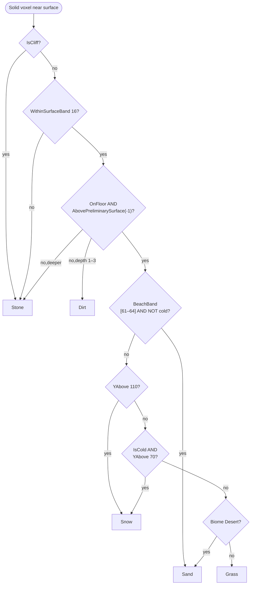

Everything produced so far has been continuous. The heightmap is a smooth field shaped by splines. Biome assignments are continuous up to a lookup boundary. Density is a signed float evaluated at 729 cell corners and interpolated across the rest. The surface rule system is where the engine crosses from continuous to discrete: at this exact voxel, given everything the preceding passes computed, what *Block* do I write?

Grass? Sand? Snow? Stone? Dirt? The answer depends on intersecting conditions — the local slope, distance from sea level, altitude, biome, how many solid blocks separate this voxel from open air above it — and some of those conditions override others regardless of what the others would choose. A cliff face gets bare Stone even in a tropical biome. A beach gets Sand even inside a forest. An alpine summit gets Snow even in Plains. The engine encodes these overrides as a **priority-ordered rule tree** that is data, not code: authored once in `assets/worldgen/default.ron`, loaded at startup, walked once per solid near-surface voxel by `fill_chunk`.

## The picture

The rule tree is a `Sequence`: the engine walks entries in order and stops at the first `Block` it reaches. Inner `If` nodes short-circuit — if the condition fails, that subtree produces nothing and the walk continues. The priority order in the default config is:



Every path terminates in a `Block` leaf. Stone is also the hard fallback if every branch falls through, supplied by `unwrap_or(Block::Stone)` at the call site.

## Build it — the rule combinators

The rule tree is expressed as two Rust enums that are serialized to and from RON.

**`RuleSource`** is the action side:

```rust
// src/worldgen/surface.rs
pub enum RuleSource {
    Block(Block),
    Sequence(Vec<RuleSource>),
    If {
        condition: ConditionSource,
        then: Box<RuleSource>,
    },
}
```

`Sequence` is short-circuit OR across its children: the first child that returns a `Block` wins; the rest are skipped. `If` is a guarded branch: if the condition holds, delegate to `then`; otherwise produce `None` and let the outer `Sequence` keep walking.

**`ConditionSource`** is the predicate side. The conditions used by the default tree are:

| Condition | What it checks |
|---|---|
| `IsCliff` | `ctx.is_cliff` — column slope flag set by heightmap pass |
| `WithinSurfaceBand(n)` | `(h_target − wy).abs() ≤ n` — within *n* blocks of the column's heightmap |
| `OnFloor` | `depth_below_surface == 0` — this voxel has no solid block directly above it |
| `UnderFloor(n)` | `depth_below_surface ≤ n` — within *n* blocks below the topmost solid |
| `AbovePreliminarySurface(off)` | `wy ≥ h_target + off` — at or above the heightmap, adjusted by offset |
| `BeachBand { below_sea, above_sea }` | `wy ∈ [sea_level − below_sea, sea_level + above_sea]` |
| `YAbove(y)` | `wy ≥ y` |
| `IsCold` | biome is `Tundra` or `SnowyForest` |
| `Biome([…])` | biome is in the listed set |
| `Not(c)` | logical negation of any condition |
| `All([…])` | all conditions hold (short-circuits on first false) |
| `Any([…])` | any condition holds (short-circuits on first true) |

Additional variants exist in the enum — `SandTransitionRoll`, `Always`, `YBelow` — that are available for custom rule trees but are not wired in the default config.

`WorldgenConfig::surface` holds a `RuleSource` directly. Because it is part of the hot-reloadable config, every rule change takes effect on the next chunk that starts filling — no engine restart is needed.

## Build it — the priority order

The default `Sequence` in `assets/worldgen/default.ron` has five top-level entries plus a fallthrough.

### 1. Cliff guard

```ron
If(condition: IsCliff, then: Block(Stone)),
```

Cliff columns — those whose heightmap gradient exceeded the slope threshold — get bare Stone unconditionally and immediately. No depth check, no biome check. A grassy cliff face would look wrong and would also be impractical to generate: if the column's surface is a cliff it rarely has a flat "topmost block" at all.

### 2. Surface-band gate

```ron
If(condition: Not(WithinSurfaceBand(16)), then: Block(Stone)),
```

The surface rules only apply within 16 blocks of the column's heightmap. Voxels further than 16 blocks above or below `h_target` are Stone and exit immediately. This prevents a subtle bug: after a chunk-Y reset or at a cave ceiling deep underground, `depth_below_surface` can be zero even though the block is nowhere near the natural terrain surface. Without this gate, cave ceilings would receive grass.

### 3. Topmost-block selection

The largest subtree fires only when `OnFloor AND AbovePreliminarySurface(-1)` — meaning this voxel has no solid block above it *and* is at or above the column's preliminary heightmap. A cave roof below the heightmap is excluded: `OnFloor` would be true at a cave ceiling, but `AbovePreliminarySurface(-1)` would be false because the cave is underground.

Inside this guard, the priority sub-sequence selects the surface block:

**Beach.** `BeachBand(below_sea: 1, above_sea: 2) AND NOT IsCold`. Sea level is 62, so the beach band spans Y 61 to Y 64 — four blocks straddling the waterline. Non-cold biomes in this band receive Sand regardless of their nominal biome material. Tundra and SnowyForest are excluded (`NOT IsCold`) so their shores stay snowy rather than sandy.

**Alpine snow line.** `YAbove(110)`. Any biome above altitude 110 receives Snow on the topmost block. Mountain peaks are white even in Plains or Forest.

**Cold-biome snow cap.** `IsCold AND YAbove(70)`. Tundra and SnowyForest receive Snow from altitude 70 upward — below the universal snow line but cold enough that the biome imposes its own cap.

**Desert.** `Biome([Desert])`. The Desert biome gets Sand on the topmost block.

**Grass.** The terminal `Block(Grass)` in the sub-sequence catches every case that none of the above matched — Plains, Forest, Tropical surface blocks all become Grass.

### 4. Cave-roof guard

```ron
If(condition: OnFloor, then: Block(Stone)),
```

After the topmost-block subtree, any remaining `depth == 0` voxel is a cave ceiling below the heightmap. It becomes Stone.

### 5. Sub-surface dirt

```ron
If(
    condition: All([UnderFloor(3), AbovePreliminarySurface(-4)]),
    then: Block(Dirt),
),
```

Voxels at depth 1, 2, or 3 below the topmost solid — but only when also within 4 blocks of the heightmap — become Dirt. This is the classic grass-cap underlayer: Grass on top, three blocks of Dirt beneath it, Stone below that. The `AbovePreliminarySurface(-4)` gate prevents the three blocks under a cave roof from also becoming Dirt; only the natural terrain cap gets the Dirt layer.

### 6. Stone fallthrough

```ron
Block(Stone),
```

Everything else: Stone.

## Build it — `depth_below_surface`

The conditions `OnFloor`, `UnderFloor`, and `AbovePreliminarySurface` all depend on `depth_below_surface`, a per-column counter tracked by a top-down scan inside `fill_chunk`.

The scan walks the column from top to bottom. When it transitions from air to solid, it initializes the counter to 0 (`OnFloor`). Each subsequent solid block increments the counter. When it transitions back to solid-to-air (entering a cave), it resets to `None`. When the next solid block appears below the cave — a cave floor — the counter restarts at 0 again for that run of solid blocks.

`fill_chunk` prefixes a "seed depth" check at the top of each chunk column: if the voxel one block above this chunk's ceiling was already solid (inspected from the chunk above), `depth_below_surface` is seeded at 4 rather than `None`, so columns entering a chunk mid-rock don't falsely fire the surface rules.

This counter is what lets the rule tree distinguish "the actual terrain surface" from "a cave ceiling" and from "deep bedrock" — three different situations where `is_cliff` is false and solid blocks are present, but only one of which should receive topsoil.

## Build it — the `SandTransitionRoll` variant

The `ConditionSource` enum includes a `SandTransitionRoll` variant that is not used in the default rule tree but is available for custom configurations:

```rust
ConditionSource::SandTransitionRoll { temp_min, probability } => {
    if ctx.desertness < temp_min || matches!(ctx.biome, Biome::Desert) {
        return false;
    }
    let roll = hash::mix_unit(ctx.seed, &[ctx.wx, ctx.wz, 71]);
    roll < probability
}
```

When `desertness` (a per-column float from the climate system) is above `temp_min` but the column has not yet crossed into a full Desert biome, this condition fires on a per-block stochastic roll. The effect is a frayed transition band at desert edges — individual blocks mix grass and sand probabilistically rather than switching cleanly at a biome boundary line. The per-block hash (`wx`, `wz`, constant `71`) produces spatially stable noise: the same block always gets the same roll, so the pattern doesn't flicker across regen.

This is the same pattern used by Voronoi jitter in [1.5](../part-1-foundations/1.5-voronoi.mdx): apply a stable per-point hash to soften what would otherwise be a hard lookup boundary.

## In the engine

The call site in `fill_chunk` constructs a `SurfaceContext` from the per-column cached values and walks the rule tree:

```rust
// src/worldgen/mod.rs — fill_chunk (abridged)
let depth = depth_below_surface.map(|d| d + 1).unwrap_or(0);
let surf_ctx = surface::SurfaceContext {
    wx,
    wy,
    wz,
    h_target: height,
    biome: col.biome,
    is_cliff: col.is_cliff,
    desertness: col.desertness,
    depth_below_surface: depth,
    lake_rim,
    seed,
    cfg: &cfg,
    sea_level: SEA_LEVEL,
};
cfg.surface.apply(&surf_ctx).unwrap_or(Block::Stone)
```

`cfg.surface` is a `RuleSource` stored directly in `WorldgenConfig`. `apply` walks the tree and returns `Option<Block>`. The `unwrap_or(Block::Stone)` is a defensive fallback — a well-formed rule tree with a terminal `Block(Stone)` should never produce `None`, but the fallback guarantees the chunk cannot contain an uninitialized voxel even if the tree is malformed.

Because `WorldgenConfig` is hot-reloadable, editing `assets/worldgen/default.ron` at runtime and triggering a regen applies the new rule tree to the next chunk filled. The rule tree is not cached in the `Generator` struct; it is read from `cfg` at the point of evaluation.

## What you can now do

Read `src/worldgen/surface.rs` end to end — it is around 230 lines including all condition variants, unit tests, and the `SurfaceSystem` wrapper. The tests cover `OnFloor`, `UnderFloor`, `BeachBand`, `WithinSurfaceBand`, `Not`, `All`, `Any`, `Sequence`, `cliff_to_stone`, `snow_capped_biomes`, and a full RON serialization round-trip.

To modify surface appearance without recompilation, edit the `surface:` section of `assets/worldgen/default.ron`:

- Change the alpine snow line: `YAbove(110)` → any altitude.
- Widen the beach: `BeachBand(below_sea: 1, above_sea: 2)` → larger values for broader sandy shores.
- Lower the cold-biome snow cap: `YAbove(70)` inside the `IsCold` branch.
- Add a new surface material: insert a new `If(condition: Biome([Tropical]), then: Block(RedSand))` before the terminal `Block(Grass)`.
- Enable sand-transition fraying: add `SandTransitionRoll { temp_min: 0.4, probability: 0.3 }` as a condition wrapping a `Block(Sand)` rule before the Desert biome check.
- Deepen the Dirt layer: change `UnderFloor(3)` to `UnderFloor(5)` for a thicker sub-surface cap.

## Next

→ [4.7 Aquifers](./4.7-aquifers.mdx)
