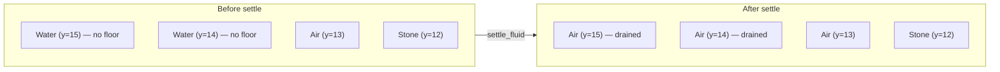
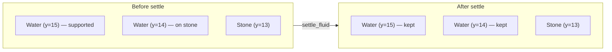

The aquifer chapter placed Water and Lava based on a pressure model that is correct on average. On average is not the same as everywhere. A cell's water table is a horizontal surface; the carved terrain it floods is anything but. The result is that some aquifer-placed fluid ends up in geometrically impossible positions — perched on the edge of a sloped cave floor with nothing beneath it, or filling a tilted pocket whose lower wall the carver opened just one block too wide. Real fluid would drain in milliseconds. In a static voxel world, it just sits there, floating.

The fluid settle pass removes those phantom blocks. It is a single bottom-up sweep through the chunk, O(chunk_volume), no iteration to convergence, no neighbour queries outside the chunk. It is not a fluid simulation. It is a filter that discards the most obviously wrong placements and leaves everything else alone.

## The picture





The two columns illustrate the core rule. A fluid voxel at `y` is supported iff the voxel directly beneath it at `y-1` is solid, is a supported fluid, or is a non-masked fluid (ocean, lake). No solid beneath means no support, and unsupported fluid drains. The column on the left has Air at `y=13`, so the two water voxels above it are floating — both drain. The column on the right has Stone at `y=13`, so `y=14` is supported, and `y=15` inherits that support through the fluid column — both are kept.

## Build it

### 1. The mask arrives from fill_chunk

The aquifer system does not call `settle_fluid` directly. `fill_chunk` accumulates a flat `bool` array — one entry per voxel in the chunk — as it processes the Y loop:

```rust
// src/worldgen/mod.rs — fill_chunk (abridged)
let mut aquifer_mask = vec![false; dim * dim * dim];

// ... per-voxel loop ...

let block = if let aquifer::Substance::Block(b) = aq_substance {
    aquifer_mask[lx + dim * ly + dim * dim * lz] = true;
    b
} else if in_lake || in_ocean {
    Block::Water   // surface flood — NOT masked
} else {
    ...
};
```

`aquifer_mask[idx] = true` only fires on the aquifer path. Ocean water, lake water, and all surface-flood blocks land in the chunk without being masked. That distinction is everything: `settle_fluid` will only examine masked voxels. Non-masked fluid is, by construction, surface water — either placed by the flood path (which always fills downward from a valid surface) or from a future runtime source. Both categories are already in correct positions and must not be disturbed.

### 2. The support propagation — bottom-up sweep

`settle_fluid` runs two sequential passes over the chunk, both in `(Y, Z, X)` order:

**Phase 1 — compute support.** Allocates a `Vec<bool>` of the same length as the chunk and fills it bottom-up:

```rust
// src/worldgen/fluid.rs
pub fn settle_fluid(chunk: &mut DenseChunk, aquifer_mask: &[bool]) {
    let mut supported = vec![false; chunk_volume];

    for y in 0..CHUNK_DIM_U {
        for z in 0..CHUNK_DIM_U {
            for x in 0..CHUNK_DIM_U {
                let idx = chunk_idx(x, y, z);
                if !aquifer_mask[idx] { continue; }
                if !is_fluid(chunk.get(LocalPos(UVec3::new(x, y, z)))) { continue; }

                if y == 0 {
                    supported[idx] = true;  // chunk floor — conservative
                    continue;
                }

                let below_idx = chunk_idx(x, y - 1, z);
                let below = chunk.get(LocalPos(UVec3::new(x, y - 1, z)));

                supported[idx] = if matches!(below, Block::Air) {
                    false
                } else if is_fluid(below) {
                    if aquifer_mask[below_idx] {
                        supported[below_idx]  // chain through masked fluid
                    } else {
                        true  // non-masked body below — always supported
                    }
                } else {
                    true  // solid below
                };
            }
        }
    }
    ...
}
```

**Phase 2 — demote.** A second pass, order irrelevant this time, converts every unsupported masked fluid voxel to Air:

```rust
    for y in 0..CHUNK_DIM_U {
        for z in 0..CHUNK_DIM_U {
            for x in 0..CHUNK_DIM_U {
                let idx = chunk_idx(x, y, z);
                if !aquifer_mask[idx] || supported[idx] { continue; }
                let pos = LocalPos(UVec3::new(x, y, z));
                if is_fluid(chunk.get(pos)) {
                    chunk.set(pos, Block::Air);
                }
            }
        }
    }
```

### 3. The support rules in detail

**Solid below → supported.** Any non-fluid, non-air block beneath a masked voxel constitutes a floor. Stone, ore, bedrock — they all count the same way.

**Masked fluid below → chain.** If the voxel directly below is also a masked aquifer voxel, support is inherited: the lower voxel's `supported` flag is read. Because the loop runs bottom-up and the lower voxel was processed in an earlier iteration of the Y loop, that flag is already final. No second pass, no iteration — one pass suffices.

**Non-masked fluid below → supported.** If the voxel below is fluid but not aquifer-masked — i.e. it is ocean or lake water placed by the surface flood — the aquifer voxel above it is considered supported. The surface body is by definition correctly placed, and the aquifer voxel directly atop it is physically resting on that body.

**Lateral neighbours → not consulted.** A cave wall to the left, a ceiling above, or ocean water to the right confers no support. Only the voxel directly beneath matters. This is the key rule that removes perched fluid: a block that sits level with a solid wall but has air beneath it drains. If lateral adjacency conferred support, every horizontal cave floor that one aquifer-placed voxel touches a wall would keep all the floating voxels in the same slab — which is exactly the bug the pass exists to eliminate.

**y = 0 boundary → conservatively supported.** Rather than query the chunk below, `settle_fluid` conservatively marks every masked voxel at `y = 0` as supported. The rationale: the voxel below lives in the adjacent chunk, which has not yet been built when this chunk is settling. Cross-chunk queries would require sequencing constraints the worldgen pipeline does not impose. The conservative choice is safe because the bottom row of a chunk is extremely unlikely to contain aquifer fluid — the bedrock and slide-hardened zone that flanks `y_min` fills those rows with solid before the aquifer sees them.

### 4. Lava behaves identically

The `is_fluid` predicate matches both `Block::Water` and `Block::Lava`:

```rust
#[inline]
fn is_fluid(b: Block) -> bool {
    matches!(b, Block::Water | Block::Lava)
}
```

There is no separate lava path. A floating lava voxel in a tilted ceiling pocket drains to Air by exactly the same logic as floating water.

## In the engine

The function signature and call site:

```rust
// src/worldgen/fluid.rs
pub fn settle_fluid(chunk: &mut DenseChunk, aquifer_mask: &[bool])
```

```rust
// src/worldgen/mod.rs — fill_chunk, after the voxel loop
fluid::settle_fluid(out, &aquifer_mask);
```

It runs after the Y-loop that fills the chunk and before `add_trees`. The chunk's surface blocks, stone, ore, ocean water, and lake water are all already in place by this point; `settle_fluid` only rewrites blocks that the aquifer placed and that fail the support check. Trees land on terrain that has already been settled.

Complexity is `O(chunk_volume)` with a constant of two full-chunk traversals plus one `bool` array allocation. For a 32×32×32 chunk that is 65 536 voxels × 2 sweeps, approximately 32 KB of working memory, and no noise sampling. The pass does not appear in any profiling output at meaningful cost.

## Honest caveat

This pass removes the most obviously wrong placements. It does not simulate fluid mechanics.

It does not model downhill flow over a curved surface — a pool sitting in a bowl with one corner hovering over an air pocket will keep the three corners that are supported and silently discard the one that is not, leaving an asymmetric pool rather than a level one. It does not model pressure equalization between connected bodies at different heights. It does not model surface tension or capillary effects (nor should it — voxel scale makes both irrelevant). It does not propagate drains across chunk boundaries; a two-chunk-tall unsupported column will be settled correctly within each chunk independently, but the cross-chunk chain must be handled by the mesh-build / re-settle logic that runs when adjacent chunks are both built.

The intent is to eliminate the *egregious* floaters — water hanging in midair with nothing beneath it at all — without requiring a multi-pass iterative solver or cross-chunk coordination. A future runtime fluid system (block-break events, source placement, spreading) will replace this static approximation. The function signature (`&mut DenseChunk`, `&[bool]`) is deliberately generic: the runtime wrapper can build a different mask (all water in an affected region, all blocks downstream of a broken dam) without touching the algorithm.

## What you can now do

Read `src/worldgen/fluid.rs` — it is the shortest file in `worldgen`, around 270 lines including the test suite. The tests cover the regression cases explicitly:

- `isolated_floating_voxel_is_demoted` — one block in midair
- `slab_with_one_support_keeps_only_the_supported_voxel` — lateral adjacency to a supported voxel does not help
- `lateral_ocean_does_not_support_aquifer_voxel` — ocean next to, not below
- `aquifer_voxel_above_ocean_is_kept` — ocean directly below does help
- `water_with_only_rock_above_is_demoted` — ceiling rock is not a floor

The only operational tuning point is the `y = 0` boundary policy. If a future chunk sequencing guarantee allows the chunk below to be pre-built before this chunk settles, the conservative `supported[idx] = true` line at `y == 0` can be replaced with a cross-chunk lookup. That change would correctly drain a zero-row aquifer voxel whose actual chunk-below voxel is Air — currently, that edge case is left as supported (false positive, never a false negative).

## Next

→ [4.9 Trees](./4.9-trees.mdx)
