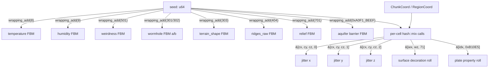

Part I has shown you the mixer, Part II gave you the pipeline overview, and Part III and IV walked you through every major stage. One claim has been quietly threaded through all of it: given the same `(seed, ChunkCoord)`, the engine produces byte-identical output — on any machine, in any chunk order, at any time. This chapter is the audit. It names the small set of conventions that hold that promise together, shows you the exact salts in the code, and verifies the negative case: none of the things that would break purity appear anywhere in `src/worldgen/`.

## The picture

Every random decision in the pipeline descends from exactly two inputs: the world seed and some integer coordinates. That descent has two layers.



Every leaf converges to the same `hash::mix` function (`src/worldgen/hash.rs`). Nothing escapes to a stateful RNG.

**Things that would break it — none of which are in the codebase:**

- `rand::thread_rng()` — output depends on thread scheduling.
- `Instant::now()` / `SystemTime` — output depends on wall-clock time.
- `RandomState` — output depends on the per-process hash seed chosen by the Rust runtime.
- `HashMap` iteration in a worldgen path — iteration order is nondeterministic across runs (same `RandomState` caveat applies).

## Build it — layer one: per-noise-field salts

The first layer lives in `Generator::new_internal` (`src/worldgen/mod.rs`) and the constructors of supporting subsystems. Each continuous noise field — the FBM Simplex fields that produce smooth terrain, climate, and cave structure — is seeded with a distinct offset from the world seed:

| Field | Salt | Location |
|---|---|---|
| `temperature_map` | `seed.wrapping_add(8)` | `mod.rs` — climate |
| `humidity_map` | `seed.wrapping_add(9)` | `mod.rs` — climate |
| `weirdness_noise` | `seed.wrapping_add(501)` | `mod.rs` — biome variant axis |
| `wormhole_noise.a` | `seed.wrapping_add(301)` | `caves.rs` — deep wormhole channel A |
| `wormhole_noise.b` | `seed.wrapping_add(302)` | `caves.rs` — deep wormhole channel B |
| `terrain_shape` | `seed.wrapping_add(303)` | `heightmap.rs` — vertical profile bias |
| `ridges_raw` | `seed.wrapping_add(404)` | `heightmap.rs` — mountain ridge noise |
| `relief` | `seed.wrapping_add(701)` | `heightmap.rs` — surface relief detail |
| `aquifer barrier` | `seed.wrapping_add(0xA0F1_BEEF)` | `aquifer.rs` — aquifer barrier FBM |

The specific numbers don't matter; only *distinctness* does. Temperature and humidity both use small sequential integers (`8`, `9`) because there is no chance of collision with any other field. Wormhole channels use `301` and `302` — adjacent, because they are a matched pair. The relief FBM at `701` is far enough from terrain fields (`303`, `404`) that there is no accidental overlap even if new fields are inserted.

The convention for adding a new noise channel: pick an integer not already in this table, use `seed.wrapping_add(that_integer)`, and add it here.

## Build it — layer two: per-call-site salts

The second layer handles discrete rolls — "is this column a plant spawn?", "where exactly does this aquifer cell center land?", "which exit does this cave chamber use?". Each such roll is a single call to `hash::mix_unit`, `hash::mix_range`, or `hash::mix_u32`.

The calling convention is: coordinates first, salt last.

```rust
// src/worldgen/aquifer.rs — three-axis jitter for aquifer cell centers.
// Salts 0, 1, 2 give three uncorrelated rolls at the same (cx, cy, cz).
let jx = (hash::mix(self.seed, &[cx, cy, cz, 0]) as u32) % cell_width;
let jy = (hash::mix(self.seed, &[cx, cy, cz, 1]) as u32) % cell_height;
let jz = (hash::mix(self.seed, &[cx, cy, cz, 2]) as u32) % cell_depth;
```

```rust
// src/worldgen/surface.rs — plant spawn probability at column (wx, wz).
// Literal 71 is the salt that identifies this particular decoration rule.
let roll = hash::mix_unit(ctx.seed, &[ctx.wx, ctx.wz, 71]);
```

```rust
// src/worldgen/aquifer.rs — aquifer cell property rolls.
// Salts 3, 4, 5 extend the jitter series without colliding.
let jitter_unit = hash::mix_unit(self.seed, &[cx, cy, cz, 3]);
let fluid_roll  = hash::mix_unit(self.seed, &[cx, cy, cz, 4]);
let dry_roll    = hash::mix_unit(self.seed, &[cx, cy, cz, 5]);
```

The salts are **inline integer literals**, not named constants. Chapter 1.2 was written when the design assumed named constants (`JITTER_X_SALT`, etc.) would exist — they don't. The actual convention is co-location: the salt integer lives at the call site, immediately adjacent to the roll it controls, making it trivial to see what salt each roll uses without navigating to a constants file. The cost is that salts aren't centrally registered; the benefit is zero indirection and no risk of two rolls silently sharing a renamed constant.

To add a new roll at an existing location: pick any integer not already used by another `hash::mix*` call at that `(seed, coord...)` prefix, and append it as the last word.

## The purity guarantee

`Generator::fill_chunk(coord, &mut out)` is a pure function of `(self.seed, coord)`. Concretely:

- **Idempotent:** Filling `ChunkCoord(0, 2, 0)` twice with the same generator produces byte-identical `DenseChunk` values both times. The region caches that `fill_chunk` consults (built per-region before per-chunk) are themselves pure functions of `(seed, RegionCoord)` — they are memoised, not stateful.
- **Order-independent:** A server filling 64 chunks in parallel can dispatch them in any order; each chunk depends only on its own coordinate and the generator's seed, not on any shared mutable state between chunks.
- **Restart-safe:** A chunk loaded from disk, evicted, and regenerated later produces the same bytes. The disk copy and the recomputed copy are interchangeable.

The region cache (5.2) is memoisation, not new state. It caches the result of `build_fine_region(seed, coord)`, but that function is itself pure. Evicting a region cache entry doesn't lose information — the entry can be reconstructed identically.

## The negative case — verified

The claim "no non-deterministic calls exist in worldgen" is checkable directly:

```
$ grep -rn "rand::thread\|Instant\|SystemTime\|HashMap" src/worldgen/
(no output)
```

The search returns nothing. No thread-local RNG, no wall-clock queries, no `HashMap` whose iteration order would leak into worldgen output. This isn't a runtime check; it's structural — the worldgen module's only source of randomness is `hash::mix` and the seeded FBM constructors.

## Test infrastructure

The determinism guarantee is pinned by three tests in `src/worldgen/mod.rs`:

**`fill_is_deterministic`** (line 1780) — Constructs `Generator::new(42)`, calls `fill_chunk(IVec3::ZERO)` twice into separate buffers, and asserts their hashes are equal. This is the tightest possible restatement of the core guarantee.

**`different_seeds_differ`** (line 1790) — Constructs two generators with seeds `1` and `2`, fills `ChunkCoord(0, 2, 0)` with each, and asserts the hashes differ. A trivial sanity check: if the seed had no effect, this would fail.

**`golden_seed42_chunk_0_2_0`** (line 1802) — Fills `ChunkCoord(0, 2, 0)` with seed 42 and compares against a pinned hash (`0xD906_D86A_4CE6_F47C`). This is the regression guard. Every time a worldgen stage changes its output — a new noise field, a modified density formula, a changed cave threshold — this test fails until the maintainer explicitly updates the golden value. The comment in the source records the reason for each rebaseline (currently: "3D density evaluator inside SURFACE_BAND; chevron-staircase artifact removed").

All three tests live as inline `#[test]` blocks, not in a separate `tests/` directory. They run as part of `cargo test` and as part of CI.

## What you can now do

Read every `wrapping_add` call in `src/worldgen/` and know which noise field it seeds. Read every `hash::mix*` call and recognize the trailing literal as the per-call salt. The two-layer structure — field salts at construction time, call-site salts at roll time — is complete; no third mechanism exists.

Adding a new noise channel correctly requires two things:

1. One new `seed.wrapping_add(N)` in the relevant constructor, where `N` is distinct from all existing salts.
2. Per-roll call-site salts inline at each `hash::mix*` invocation for that channel.

Missing either produces correlated output with another channel — which may not be immediately obvious visually, but will surface as suspicious terrain repetition at the spatial frequency of whichever fields share a salt.

## Next

→ [5.2 The Region Cache](./5.2-region-cache.mdx)
