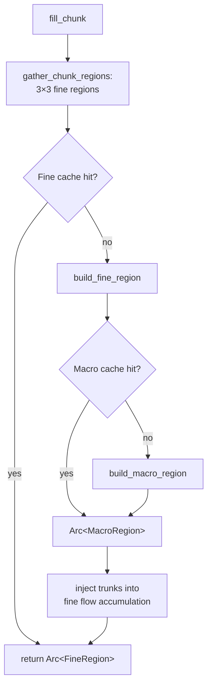

# 5.2 The Region Cache

A chunk is 32 blocks per side. A **fine region** — the unit of worldgen
caching — is 512 blocks per side. So one fine region contains 16 × 16 = 256
chunks. Running D8 flow accumulation across a 64 × 64 cell grid, rolling cave
system placements, and computing the biome hydrology for that region is
expensive. Paying that cost once and reusing it across 256 consecutive chunk
fills is the difference between a playable engine and a slideshow. The region
cache is what makes that reuse safe, deterministic, and bounded in memory.

## The two-level picture

`fill_chunk` starts by calling `gather_chunk_regions`, which populates a 3 × 3
grid of **fine region** handles centred on the chunk's origin region. The chunk
needs neighbours — river segments and cave systems can spill across region
boundaries — so nine regions come in together before any block is placed.

Each fine region may in turn depend on the **macro region** that contains it.
Macro regions encode the trunk-river pass: they operate at 8192-block
granularity (128 × 128 macro cells, one macro cell = 64 blocks per side) and
are consulted when building the fine flow accumulation to inject large-scale
drainage patterns. The macro build only calls noise; it never reaches back into
the fine cache. The dependency is strictly one-way.



Both caches are defined in `src/worldgen/region.rs` and initialised inside
`Generator::new_internal`:

```rust
fine_cache:  region::fresh_fine_cache(),
macro_cache: region::fresh_macro_cache(),
```

The types are simple type aliases:

```rust
pub type FineCache  = Arc<Mutex<LruCache<RegionCoord,      Arc<FineRegion>>>>;
pub type MacroCache = Arc<Mutex<LruCache<MacroRegionCoord, Arc<MacroRegion>>>>;
```

Capacities come from `src/worldgen/tuning.rs`:

```rust
pub const FINE_CACHE_CAP:  usize = 256;
pub const MACRO_CACHE_CAP: usize = 32;
```

## What the caches hold

### FineRegion

A `FineRegion` stores per-cell data over a 64 × 64 grid (one cell per 8-block
square, one grid per 512-block region):

| Field | Type | Per-cell cost |
|---|---|---|
| `h_pre` | `Box<[i16]>` | 2 B |
| `flow_dir` | `Box<[u8]>` | 1 B |
| `flow_acc` | `Box<[u32]>` | 4 B |
| `is_river` | `Box<[u8]>` (bitset) | 1/8 B |
| `is_lake` | `Box<[u8]>` (bitset) | 1/8 B |
| `width` | `Box<[f32]>` | 4 B |
| `lake_rim` | `Box<[i16]>` | 2 B |

With 4096 cells (64 × 64), the scalar arrays total roughly 53 KB per entry.
Add the `segments: Vec<RiverSegment>` and `cave_systems: Vec<CaveSystem>`
vectors (sizes vary by terrain density) and a typical live fine region is in
the range of 50–80 KB. At the default cap of 256 entries that is about 13–20
MB for the fine cache.

### MacroRegion

A `MacroRegion` covers a 128 × 128 macro-cell grid (one macro cell = 64
blocks, one grid per 8192-block region):

| Field | Type |
|---|---|
| `flow_dir` | `Box<[u8]>` |
| `flow_acc` | `Box<[u32]>` |
| `is_trunk` | `Box<[u8]>` (bitset) |
| `is_lake` | `Box<[u8]>` (bitset) |
| `lake_rim` | `Box<[i16]>` |

With 16 384 cells, the fixed-size arrays run to about 114 KB per entry. At the
default cap of 32 entries that is around 3.6 MB for the macro cache. Total
warm-cache footprint at default caps: roughly 17–24 MB.

## The lookup-or-build pattern

Both caches use the same two-phase idiom. Here is the actual implementation of
`get_fine` from `src/worldgen/region.rs`:

```rust
pub fn get_fine<F>(cache: &FineCache, coord: RegionCoord, build: F) -> Arc<FineRegion>
where
    F: FnOnce() -> FineRegion,
{
    if let Some(r) = cache.lock().expect("fine cache mutex poisoned").get(&coord) {
        return r.clone();
    }
    let region = Arc::new(build());
    cache
        .lock()
        .expect("fine cache mutex poisoned")
        .put(coord, region.clone());
    region
}
```

`get_macro` is structurally identical. Three details are worth calling out.

**The lock is released before building.** The hot path acquires the mutex,
checks for a cached `Arc`, and returns immediately on a hit. On a miss it
drops the lock, runs `build()`, acquires the lock again, and inserts. Other
threads can freely read the cache — and even build different regions — during
this thread's build.

**Duplicate-build races are accepted.** If two chunk-fill workers see the same
cold coord simultaneously, both will build the region. The second `put` just
overwrites the first. Because the build is a pure function of `(seed, coord)`,
both workers produce byte-identical output. Paying the occasional duplicate
build is cheaper than the synchronisation complexity of a single-flight
(per-key `OnceCell` or `DashMap`-of-futures) solution.

**LRU eviction is transparent.** When an entry is evicted to stay within the
cap, any subsequent access rebuilds it with the same result. The engine's
purity guarantee — "same seed and chunk coord always produces the same blocks"
— treats the cache as a transparent optimisation, not an authoritative store.

There is one additional accessor, `peek_fine`, which reads without updating LRU
order and returns `None` on a miss without building. The hydrology stitcher
uses this to inspect already-built neighbours without reshaping the eviction
order.

## The halo problem

Flow accumulation is not a local computation. Water drains from upstream cells
into downstream ones, so building the flow field for a fine region requires
knowing the elevation of cells in adjacent regions. A naive recursive approach
— call `get_fine` for all neighbours inside `build_fine_region` — would produce
a cascade of dependent builds whenever the cache is cold.

Oxium avoids this by **recomputing the halo from noise rather than the cache**.
The fine region build samples `h_pre` over a 5 × 5 region window (the target
region plus a two-region halo on each side, controlled by `FINE_HALO_REGIONS =
2`). The 2560-block sampling window gives a ~2.5 km sink-fill horizon. Once the
local flow accumulation is computed, the halo data is discarded. The cost is
roughly 10 000 extra noise evaluations per build; the benefit is that each
region builds independently with no inter-region lock dependencies.

> **Note:** The `FINE_HALO_REGIONS = 2` constant controls this trade-off. A larger halo improves sink-fill accuracy over long drainage paths at the cost of more noise evaluations per build.

The macro build is simpler: macro cells are coarse enough (64 blocks each) that
the `MACRO_HALO_REGIONS = 1` halo covers ~24 km, which comfortably encloses
any realistic trunk-river watershed. Like the fine build, it only calls noise
and never recurses into the cache.

## Thread safety

The engine runs up to sixteen concurrent chunk-fill workers. Both caches use a
single `Mutex` — one per cache, not one per entry. Contention is low in
practice because:

- Cache hits release the lock immediately (just a clone of an `Arc`).
- Builds happen outside the lock, so the mutex is not held during the
  expensive part.
- Each region is large (16 × 16 chunks), so a build happens at most once per
  `FineRegion` lifetime and the miss rate drops quickly after warm-up.

If profiling ever reveals contention the natural next step is sharding by
`hash(coord) % N`, replacing the single mutex with an array of N smaller
caches. The interface (`get_fine`, `get_macro`) is written to make this
refactor mechanical.

## Why purity is not compromised

Chapter 5.1 established that worldgen is pure in `(seed, ChunkCoord)`: the
same inputs always produce the same output regardless of call order, thread
scheduling, or cache state. The region cache is compatible with that guarantee
because it is pure **memoisation**:

- The build function for any `(seed, coord)` pair is deterministic.
- An evicted entry that is rebuilt produces byte-identical output to the
  original.
- There is no persistent cache across program restarts; every run starts cold.

The cache is an optimisation inside the evaluation model, not a layer that
changes what the model computes.

## Tuning

Both caps are in `src/worldgen/tuning.rs`:

```rust
pub const FINE_CACHE_CAP:  usize = 256;   // ~17–24 MB at typical entry sizes
pub const MACRO_CACHE_CAP: usize = 32;    // ~3.6 MB
```

Raising `FINE_CACHE_CAP` helps when a player is flying fast across the world
and outrunning the 16 × 16 region (256-chunk) working set. Lowering it saves
memory on constrained targets at the cost of more rebuilds. The macro cap
rarely needs adjustment — a macro region covers 16 × 16 = 256 fine regions, so
32 entries is already a very large working set (32 × 256 × 256 = over two
million chunks).

## In the engine

The `Generator` struct holds both caches as plain fields:

```rust
fine_cache:  region::FineCache,
macro_cache: region::MacroCache,
```

Every chunk fill begins with `gather_chunk_regions`, which calls `get_fine`
nine times and returns a `ChunkRegions` struct (a 3 × 3 grid of
`Arc<FineRegion>`) that the per-column hot path reads without touching the
mutex again:

```rust
fn gather_chunk_regions(&self, coord: ChunkCoord) -> ChunkRegions {
    let origin = coord.origin().0;
    let center = region::RegionCoord::containing(origin.x, origin.z);
    let mut grid: [[Option<Arc<region::FineRegion>>; 3]; 3] = Default::default();
    for dz in -1..=1i32 {
        for dx in -1..=1i32 {
            let c = region::RegionCoord { x: center.x + dx, z: center.z + dz };
            grid[(dz + 1) as usize][(dx + 1) as usize] =
                Some(region::get_fine(&self.fine_cache, c, || self.build_fine_region(c)));
        }
    }
    ChunkRegions { center, grid }
}
```

That is the only place the cache mutex is acquired during a chunk fill. The
rest of `fill_chunk` works from the pre-fetched `Arc` handles, paying no
synchronisation cost at all.

## What you can do now

- **Read** `src/worldgen/region.rs` for the full type definitions and the
  `get_fine` / `get_macro` / `peek_fine` implementations.
- **Adjust** `FINE_CACHE_CAP` and `MACRO_CACHE_CAP` in
  `src/worldgen/tuning.rs` to tune the memory-vs-rebuild trade-off for your
  target hardware.
- **Profile** cache hit rates by temporarily wrapping `get_fine` with a hit/miss
  counter; the LRU eviction test in `region.rs` (`lru_evicts_oldest`) gives a
  baseline sanity check.

---

**Next:** [5.3 Config & Hot-Reload](./5.3-config-hot-reload.mdx)
