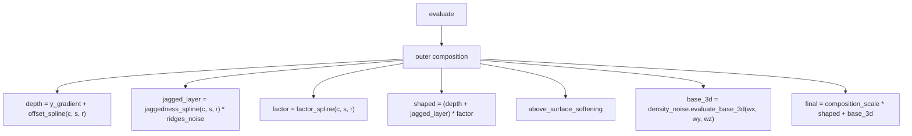
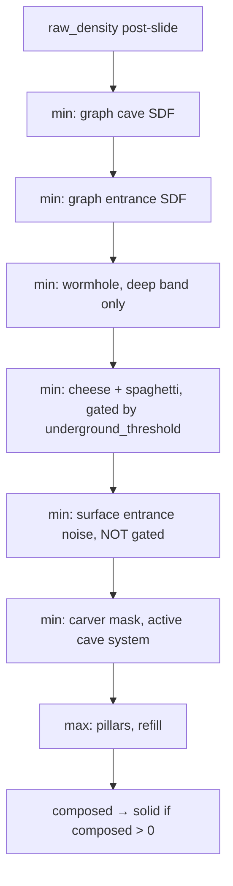

# Part IV — Per-Chunk Fill Implementation Plan (Phase 1, Plan 5)

> **For agentic workers:** REQUIRED SUB-SKILL: Use superpowers:subagent-driven-development (recommended) or superpowers:executing-plans to implement this plan task-by-task. Steps use checkbox (`- [ ]`) syntax for tracking.

**Goal:** Write the nine chapters of *Part IV — Per-Chunk Fill* — the runtime hot path that turns per-region cached data into per-voxel block decisions. Plus one widget (`CellGridSlice` for chapter 4.2). Plus any parity additions if the math demands them.

**Architecture:** One task per chapter (9 tasks). Each task reads the relevant engine source, writes the chapter, builds, commits. Task 2 (Cell Evaluator) also builds the `CellGridSlice` widget. Final review subagent verifies the whole plan, then merge.

**Tech Stack:** Same as prior plans.

**Out of plan scope:** Part V, appendices.

---

## Pre-flight: enter a worktree

```
EnterWorktree(name: "docs-part4")
```

Then:

```bash
git merge main --ff-only
cd docs/book && npm ci && cd ../..
cargo build --release --bin doc_render
```

---

## Shared patterns for every task (read once)

- **Chapter skeleton:** hook → picture (often a Mermaid diagram for the 3D-only chapters) → build-it → in-the-engine → what-you-can-now-do → next.
- **Engine grounding rule:** every task starts with reading the actual source. The plan's code blocks are *drafts*; if reality differs, fix the chapter.
- **Image-embedding pattern:** Most Part IV stages are 3D (caves, density, aquifers in the volume) — chapter 2.1's 2D top-down images don't capture them well. Use Mermaid diagrams or simplified inline code blocks instead.
- **Forward/back link convention:** `./4.X-foo.mdx` for siblings; `../part-3-region-build/3.X.mdx` for backward; `../part-5-engineering/5.X.mdx` or `../appendices/X.mdx` for forward.
- **Reference chapters:** the closest matches for tone — 3.4 (algorithmic walkthrough with widget), 3.3 (engine-grounded code-heavy), 3.6 (Mermaid-diagram-driven structural chapter).

Engine source files touched by Part IV:
- 4.1 Density Graph → `src/worldgen/density_graph.rs`
- 4.2 Cell Evaluator → `src/worldgen/density_graph.rs::CellEvaluator`
- 4.3 Composing Caves → `src/worldgen/mod.rs::fill_chunk` (the cave-composition block in the y-loop)
- 4.4 Noise Carvers → `src/worldgen/caves.rs::{cheese_contribution, spaghetti_contribution, pillar_contribution, surface_entrance_contribution}` and `NoiseCarvers`
- 4.5 Procedural Carvers → `src/worldgen/carver.rs` (the MC-style carver tunnel system — note: this is the ACTIVE cave generator since graph caves are currently disabled per 3.6)
- 4.6 Surface Rules → `src/worldgen/surface.rs`
- 4.7 Aquifers → `src/worldgen/aquifer.rs`
- 4.8 Fluid Settle → `src/worldgen/fluid.rs`
- 4.9 Trees → `src/worldgen/mod.rs::{tree_in_cell, Tree, tree_hash}` (the `trees.rs` file itself is empty)

---

## Task 1: Chapter 4.1 — The Density Graph

The DAG of spline nodes that maps `(continentalness, terrain_shape, ridges_pv, wy)` to a signed density value per voxel. Positive = solid; negative = air.

### Files
- Modify: `docs/book/content/part-4-chunk-fill/4.1-density-graph.mdx`

### Steps

- [ ] **Step 1: Read `density_graph.rs`**

```bash
head -80 src/worldgen/density_graph.rs
grep -n "^pub fn\|^pub struct\|^pub enum\|^impl\|build_default_tree" src/worldgen/density_graph.rs | head -25
grep -B2 -A 15 "fn evaluate" src/worldgen/density_graph.rs | head -50
```

Note: the design spec called this a "graph" but you may find the engine calls it a "tree" (build_default_tree). Use the name the engine uses.

Key things to surface:
- The node types (leaves: `y_gradient`, `base_3d`; combinators: spline-evaluated, scale, min/max, etc. — verify).
- How `build_default_tree(&cfg.climate, &cfg.density)` constructs the DAG.
- The `evaluate(wx, wy, wz, climate, density_noise, density_cfg) -> f32` entry point.
- The `slide` function (post-evaluate clamp near vertical boundaries).

- [ ] **Step 2: Write the chapter**

Replace `docs/book/content/part-4-chunk-fill/4.1-density-graph.mdx`. Target ~1500–1900 words. Standard skeleton.

**Hook:** Chapters in Part III produced per-region cached values. Now the runtime needs a *per-voxel* signed density: a single number per voxel that's positive for solid and negative for air. The density graph is the engine's authoring tool for that function. It's not a noise function — it's a tree of operations, each tuned in config, composing climate axes and a few key noise channels into the final density.

**The picture (Mermaid diagram):**



Adapt the diagram to the *actual* composition you find in source.

**Build it:** Walk through the tree from leaves up to the root. Each node has a well-defined operation:
- `y_gradient`: linear in `wy`, polarizes solid below / air above the y-bias center.
- `offset_spline(c, s, r)`: the heightmap's main contribution (from chapter 3.3); shifts the gradient up where the spline says terrain should be.
- `factor_spline(c, s, r)`: regional roughness amplitude.
- `jaggedness_spline(c, s, r)`: how dramatic the high-terrain features are.
- `base_3d`: 3D FBM noise that adds per-voxel variation (overhangs, ledges, surface roughness).

The leaves use values either computed cheaply (`y_gradient` is just arithmetic) or sampled from per-column splines (`offset_spline_at(c, s, r)` is one `NestedSpline::evaluate` call from chapter 3.3).

**In the engine:** Show `build_default_tree` and `evaluate`. Show how `Generator::fill_chunk` calls `graph.evaluate(wx, wy, wz, climate, &self.density, &cfg.density)` to get the per-voxel density.

**The slide function:** Briefly explain that `slide(density, wy, &density_cfg)` is a post-evaluation clamp that prevents weird artifacts near the world's y-boundaries (e.g., very low `wy` forces toward solid; very high forces toward air). Cite the function.

**What you can now do:** Read `density_graph.rs` end-to-end and recognize each spline call site. Understand the `cfg.density` knobs in `assets/worldgen/default.ron`.

**Next:** → `4.2 The Cell Evaluator`.

- [ ] **Step 3: Build + commit**

```bash
cd docs/book && npm run build 2>&1 | tail -3 && cd ../..
git add docs/book/content/part-4-chunk-fill/4.1-density-graph.mdx
git commit -m "content(book): write 4.1 The Density Graph

Chapter on the per-voxel signed-density tree. Leaves (y_gradient,
offset/factor/jaggedness splines, base_3d FBM) compose through scale
and softening into the final density; positive = solid, negative = air.
Includes the slide clamp at vertical boundaries.

Co-Authored-By: Claude Opus 4.7 (1M context) <noreply@anthropic.com>"
```

---

## Task 2: Chapter 4.2 — The Cell Evaluator + `CellGridSlice` widget

The 9×9×9 corner lattice + trilerp that makes per-voxel density cheap. The 134× speedup story.

### Files
- Create: `docs/book/src/widgets/CellGridSlice.tsx`
- Modify: `docs/book/content/part-4-chunk-fill/4.2-cell-evaluator.mdx`

### Steps

- [ ] **Step 1: Read `CellEvaluator`**

```bash
sed -n '200,340p' src/worldgen/density_graph.rs
grep -n "CORNER_COUNT\|CELL_COUNT\|CellEvaluator" src/worldgen/density_graph.rs | head -10
```

Confirm: `CHUNK_DIM_U = 32`, `CELL_SIZE = 4`, `CELL_COUNT = 8`, `CORNER_COUNT = 9`. The lattice is 9×9×9 = 729 corner samples per chunk.

- [ ] **Step 2: Build the `CellGridSlice` widget**

Create `docs/book/src/widgets/CellGridSlice.tsx`. The widget visualizes a 2D slice of the 9×9 corner lattice (it's 2D for visualization clarity; the full 3D is the same idea + one more dimension).

Spec:
- 9×9 grid of corner values; each corner is a slider (input range slider, [-1, 1]).
- Below the corner grid: a 256×256 canvas showing the bilerped field over the [0, 8] interior.
- Toggle: "show exact" — render a test function (e.g., `0.5 * Math.sin(x * 0.6) * Math.cos(y * 0.6)`) at the corner values and at the interior; the test function defines what "exact" means.
- Toggle: "show error" — render `|bilerp(x, y) - exact(x, y)|` as a heatmap.

The corner sliders are a lot of UI (81 sliders for 9×9). Reasonable approach: render them as a 9×9 grid of small numeric inputs, each ~30 px wide. Or use draggable corners.

If the slider UI is unwieldy, simplify: provide a small dropdown of "preset" corner patterns (gradient, single bump, two-bumps) instead of all 81 sliders. The educational point is bilerp behavior, not authoring arbitrary fields.

Use `bilerp` from `docs/book/src/math/trilerp.ts` (which Plan 2 added).

- [ ] **Step 3: Write the chapter**

Replace `docs/book/content/part-4-chunk-fill/4.2-cell-evaluator.mdx`. Target ~1500–1900 words.

Cover:
- The 9×9×9 lattice covers a 32×32×32 chunk with 729 corner samples (vs 32,768 voxels).
- Build cost: ~729 expensive density-graph evaluations per chunk.
- Per-voxel cost: one trilerp from the surrounding 8 corners — ~7 multiplies + 7 adds. Negligible.
- Honest caveat: trilerp is an approximation. Where the exact density value would cross zero (solid/air boundary), the trilerp can sign-flip differently in interior voxels. Acceptable; visually invisible.
- The 134× number from `density_graph.rs` doc comment (per Plan 2 finding: the engine's number includes 3D height-coupling cost so it's higher than 32768/729 ≈ 45).
- The `corners` storage layout: flat array indexed `cx + cy*CORNER_COUNT + cz*CORNER_COUNT²`.

Reuse the trilerp primer from [1.9](../part-1-foundations/1.9-trilerp.mdx) for the math.

Show the `CellEvaluator::new(...)` constructor and `CellEvaluator::evaluate(wx, wy, wz)` from the engine.

- [ ] **Step 4: Build + commit**

```bash
git add docs/book/src/widgets/CellGridSlice.tsx docs/book/content/part-4-chunk-fill/4.2-cell-evaluator.mdx
git commit -m "content(book): write 4.2 Cell Evaluator + CellGridSlice widget

Chapter on the 9x9x9 corner lattice + trilerp that powers per-voxel
density evaluation in fill_chunk. Widget visualizes bilerp on a 9x9
slice with exact-vs-error overlay.

Co-Authored-By: Claude Opus 4.7 (1M context) <noreply@anthropic.com>"
```

---

## Task 3: Chapter 4.3 — Composing Caves

The signed-density min/max composition that subtracts caves from the base terrain. The carve precedence stack.

### Files
- Modify: `docs/book/content/part-4-chunk-fill/4.3-composing-caves.mdx`

### Steps

- [ ] **Step 1: Read the cave-composition block in `fill_chunk`**

```bash
grep -n "// .*Signed-density\|composed\|cave_sdf\|entrance_sdf\|wormhole_noise\|cheese_contribution\|spaghetti_contribution\|surface_entrance_contribution\|pillar_contribution\|carver_mask" src/worldgen/mod.rs | head -25
```

Read the relevant ~80-line block in `fill_chunk` where it composes caves into `composed` density. Note the exact order of layers:
1. Start with `raw_density` (post-slide).
2. Graph cave SDF (currently `(0,0)` — disabled).
3. Graph entrance SDF.
4. Wormhole noise (deep band only, below `WORMHOLE_BAND_Y`).
5. Noise carvers (cheese, spaghetti) — only if `raw_density >= cfg.cave.underground_density_threshold`.
6. Surface entrance contribution (NOT gated by underground threshold).
7. MC-style carver mask (the active cave system).
8. Pillars (refill via `max`).

- [ ] **Step 2: Write the chapter**

Replace `docs/book/content/part-4-chunk-fill/4.3-composing-caves.mdx`. Target ~1700–2100 words.

Cover:
- Why signed-density min/max instead of "carve to air"? Caves modulate a density field, allowing the surrounding logic (surface rules, aquifer, fluid settling) to operate on a coherent field rather than seeing air-cell discontinuities mid-evaluation.
- Per-layer signed-density semantic:
  - Each cave layer returns a positive intensity inside its volume.
  - Composed by `min(composed, -intensity)` — drives density toward air.
  - Pillars apply at the end with `max(composed, pillar_density)` — refill.
- The `CAVE_SURFACE_BUFFER` gate: most cave layers refuse to carve within N blocks of the surface (default 4). Exception: surface entrance noise carvers DO carve through the surface — that's how natural cave mouths happen.
- The `CAVE_FLOOR_Y` gate: nothing carves below this depth (default -120).
- The `underground_density_threshold`: noise carvers (cheese/spaghetti) only run where `raw_density` is comfortably above 0 — i.e., deep enough inside solid terrain that carving makes sense.
- The full layer order in the engine, in the order they apply.

Reference [1.8](../part-1-foundations/1.8-sdfs.mdx) for the SDF composition primer.

Use a Mermaid diagram for the layer stack:



- [ ] **Step 3: Build + commit**

```bash
git add docs/book/content/part-4-chunk-fill/4.3-composing-caves.mdx
git commit -m "content(book): write 4.3 Composing Caves

Chapter on signed-density min/max cave composition in fill_chunk.
Walks the layer order (graph SDF, wormhole, noise carvers, surface
entrance, MC carver mask, pillars) with gating rules.

Co-Authored-By: Claude Opus 4.7 (1M context) <noreply@anthropic.com>"
```

---

## Task 4: Chapter 4.4 — Noise Carvers

The cheese / spaghetti / pillar channels. The MC-style "natural-looking caves" via FBM noise channels.

### Files
- Modify: `docs/book/content/part-4-chunk-fill/4.4-noise-carvers.mdx`

### Steps

- [ ] **Step 1: Read `caves.rs` noise-carver section**

```bash
grep -n "fn cheese_contribution\|fn spaghetti_contribution\|fn pillar_contribution\|fn surface_entrance_contribution\|fn spaghetti_roughness\|NoiseCarvers" src/worldgen/caves.rs | head -15
grep -B2 -A 20 "pub struct NoiseCarvers" src/worldgen/caves.rs
grep -B1 -A 30 "fn cheese_contribution" src/worldgen/caves.rs | head -40
```

The three channels:
- **Cheese**: low-frequency FBM that carves spherical voids when above a threshold. Big open caves.
- **Spaghetti**: higher-frequency FBM, often with `|noise| < threshold` to carve tubular passages. Narrow winding tunnels.
- **Pillar**: a positive density channel that refills carved voxels. Creates standing rock columns in otherwise-air space.
- **Surface entrance**: a non-buffered FBM that punches holes through the surface buffer to create natural cave mouths.

- [ ] **Step 2: Write the chapter**

Replace `docs/book/content/part-4-chunk-fill/4.4-noise-carvers.mdx`. Target ~1500–1900 words.

Cover:
- Why three channels? Each produces a recognizable cave morphology. Composing them gives variety.
- The math for each:
  - **Cheese**: `intensity = noise > threshold ? scale * (noise - threshold) : 0`. Round, spherical.
  - **Spaghetti**: `intensity = abs(noise1 - noise2) < threshold ? carve : 0` (or similar — verify). Long tubular.
  - **Pillar**: positive density refill.
- The cave_layer² gate in cheese (cited in `mod.rs`): cheese intensity is multiplied by a function of `raw_density` so it doesn't punch through surface terrain. Look up the exact code.
- The `cfg.cave` config knobs: `cheese_threshold`, `spaghetti_threshold`, `pillar_threshold`, etc.

Reference [1.4](../part-1-foundations/1.4-fbm.mdx) for the FBM primer.

- [ ] **Step 3: Build + commit**

```bash
git add docs/book/content/part-4-chunk-fill/4.4-noise-carvers.mdx
git commit -m "content(book): write 4.4 Noise Carvers

Chapter on the MC-style cheese/spaghetti/pillar/surface-entrance FBM
channels that carve natural-looking caves. Each channel's math,
threshold/scale tunables, and the cave_layer² density gate.

Co-Authored-By: Claude Opus 4.7 (1M context) <noreply@anthropic.com>"
```

---

## Task 5: Chapter 4.5 — Procedural Carvers (THE active cave system)

The MC-style carver tunnel system. Per-chunk tunnels rasterized into a mask. **This is the active cave generator** — graph caves are disabled per 3.6.

### Files
- Modify: `docs/book/content/part-4-chunk-fill/4.5-procedural-carvers.mdx`

### Steps

- [ ] **Step 1: Read `carver.rs`**

```bash
head -100 src/worldgen/carver.rs
grep -n "^pub fn\|^pub struct\|^fn\|build_tunnels_for_chunk\|rasterize_into_mask\|CarverTunnel" src/worldgen/carver.rs | head -20
```

Key things:
- `build_tunnels_for_chunk(seed, chunk_coord) -> Vec<CarverTunnel>`. Each chunk seeds its own tunnels.
- Tunnels are pure functions of `(seed, chunk_coord)` — no caching needed beyond LRU for performance.
- `CarverTunnel` shape: probably a list of waypoints + radii.
- `rasterize_into_mask(tunnel, origin, &mut mask)`: stamps the tunnel into a per-chunk boolean mask.
- Per-chunk fill query: scan 11×5×11 neighbour chunks, collect their tunnels, rasterize each into this chunk's mask.

- [ ] **Step 2: Write the chapter**

Replace `docs/book/content/part-4-chunk-fill/4.5-procedural-carvers.mdx`. Target ~1700–2100 words.

Lead with the "this is the active cave system" framing. The reader saw cave systems described in 3.6 but learned they're currently disabled. Procedural carvers are what actually produces the caves you see in-game.

Cover:
- How a chunk's tunnels are seeded: hash the chunk coord + seed.
- The tunnel topology: each tunnel is a winding path with branches (verify the actual structure — could be a single path, could be branching).
- The neighbour-chunk reach (default 11×5×11 chunks) — why so wide? Tunnels from a chunk can extend up to ~5 chunks horizontally; the wide reach ensures every tunnel that *could* intersect this chunk's voxels is considered.
- The boolean mask: rasterize all tunnels, then for each voxel check `mask[idx]`. O(1) per-voxel lookup.
- How the mask composes into the density field in `fill_chunk` (cite the `composed = composed.min(-CAVE_SDF_INTENSITY)` when `carver_mask[idx]` line).
- Determinism: the same chunk + seed always produces the same tunnels, regardless of which neighbour chunks have been visited.

- [ ] **Step 3: Build + commit**

```bash
git add docs/book/content/part-4-chunk-fill/4.5-procedural-carvers.mdx
git commit -m "content(book): write 4.5 Procedural Carvers

Chapter on the MC-style carver tunnel system — the active cave
generator in the engine. Per-chunk tunnel seeding, rasterization
into a boolean mask, neighbour-chunk reach, density composition.

Co-Authored-By: Claude Opus 4.7 (1M context) <noreply@anthropic.com>"
```

---

## Task 6: Chapter 4.6 — Surface Rules

Cliff / beach / snow / biome material / sand-transition. The data-driven rule tree in `surface.rs`.

### Files
- Modify: `docs/book/content/part-4-chunk-fill/4.6-surface-rules.mdx`

### Steps

- [ ] **Step 1: Read `surface.rs`**

```bash
cat src/worldgen/surface.rs
```

(10 KB — read it all.)

Key things:
- `SurfaceContext` struct: all the inputs to a rule (wx, wy, wz, h_target, biome, is_cliff, desertness, depth_below_surface, lake_rim, etc.).
- `SurfaceConfig` / `SurfaceSystem`: the data-driven rule tree from the config.
- The rule combinators: `If(condition, then) → Block`, `WithinSurfaceBand`, etc.
- The `apply(&ctx) -> Option<Block>` method.
- The sand-transition band: stochastic mix of grass and sand at biome boundaries.

- [ ] **Step 2: Write the chapter**

Replace `docs/book/content/part-4-chunk-fill/4.6-surface-rules.mdx`. Target ~1500–1900 words.

Cover:
- Why a rule tree? Surface block selection has lots of intersecting cases (cliff overrides biome, snow overrides grass when y > snow line, etc.). Encoding as a priority-ordered rule tree decouples the cases.
- The rule combinators: how `If(condition, then)` and `Block(b)` compose to express decisions.
- The cliff rule: high-priority. Cliff slopes get bare stone, no soil.
- The beach rule: blocks within `[SEA_LEVEL - 1, SEA_LEVEL + 2]` of sea level on non-cold biomes become sand.
- The snow rule: y > `SNOW_LINE` OR cold biome → snow.
- The biome-material rule: terminal fallback. Grass for plains/forest/tropical; sand for desert.
- The sand-transition band: when `desertness` is just below the desert threshold, the surface rolls a per-block hash to mix grass and sand probabilistically. Frayed edges instead of a clean line.
- The depth_below_surface concept: how deep the current voxel is beneath the top of the column. Used by rules to determine "topmost block" vs "second" vs "deeper". 

- [ ] **Step 3: Build + commit**

```bash
git add docs/book/content/part-4-chunk-fill/4.6-surface-rules.mdx
git commit -m "content(book): write 4.6 Surface Rules

Chapter on the data-driven surface-block selection. Cliff/beach/snow/
biome rules, priority order, depth_below_surface tracking, the
stochastic sand-transition band at biome boundaries.

Co-Authored-By: Claude Opus 4.7 (1M context) <noreply@anthropic.com>"
```

---

## Task 7: Chapter 4.7 — Aquifers

The jittered 16×12×16 cell grid. Per-cell `y_top` + fluid kind. Pressure model. Ocean/lake yield.

### Files
- Modify: `docs/book/content/part-4-chunk-fill/4.7-aquifers.mdx`

### Steps

- [ ] **Step 1: Read `aquifer.rs`**

```bash
head -120 src/worldgen/aquifer.rs
grep -n "^pub fn\|^pub struct\|cell_for_column\|substance\|fluid\|y_top\|pressure" src/worldgen/aquifer.rs | head -25
```

Key things:
- The jittered cell grid (16 in xz × 12 in y per macro region — verify dimensions).
- Per cell: `y_top: i32` (the fluid surface level) + `fluid: Block` (Water or Lava).
- `substance(wx, wy, wz, density)` returns one of `Substance::{Block(b), Density}` — does this voxel get fluid, or yield to density's solid/air decision?
- The pressure model that decides yield-vs-claim (cite the actual logic — pressure compares the cell's fluid pressure vs the density field's solidity).

- [ ] **Step 2: Write the chapter**

Replace `docs/book/content/part-4-chunk-fill/4.7-aquifers.mdx`. Target ~1600–2000 words.

Cover:
- Why aquifers? Plain sea-level flooding produces oceans but nothing else. Aquifers fill voids inside terrain (caves, low basins) with water or lava, giving the world groundwater character.
- The jittered cell grid: a 3D Voronoi (like plates, but smaller and with fluid-kind randomness).
- Per-cell properties: `y_top` (the water/lava table) and `fluid_kind` (Water vs Lava). Lava cells happen at deep, hot locations.
- The pressure model: for a voxel below `y_top`, the aquifer "wants" to claim it. But the surrounding density field might say "this is solid terrain" — pressure decides who wins.
- Ocean/lake yield: when a voxel is in an ocean column or a lake column, the aquifer yields to the surface flood so the ocean's water comes from the surface, not the aquifer (cleaner physics for fluid settling later).

- [ ] **Step 3: Build + commit**

```bash
git add docs/book/content/part-4-chunk-fill/4.7-aquifers.mdx
git commit -m "content(book): write 4.7 Aquifers

Chapter on the jittered 3D cell grid that fills voids with water/lava.
Per-cell y_top + fluid kind, pressure model that resolves
aquifer-vs-terrain conflicts, ocean/lake yield.

Co-Authored-By: Claude Opus 4.7 (1M context) <noreply@anthropic.com>"
```

---

## Task 8: Chapter 4.8 — Fluid Settle

The post-pass over aquifer-placed voxels. Static settling — pre-runtime-fluid-mechanics workaround.

### Files
- Modify: `docs/book/content/part-4-chunk-fill/4.8-fluid-settle.mdx`

### Steps

- [ ] **Step 1: Read `fluid.rs`**

```bash
cat src/worldgen/fluid.rs | head -120
grep -n "settle_fluid\|aquifer_mask\|fn settle" src/worldgen/fluid.rs | head -10
```

Key things:
- `settle_fluid(chunk, aquifer_mask, ...)`: post-fill pass that fixes up aquifer-placed voxels.
- What does it fix? Aquifer-placed water on a slope that would obviously drain. Settling removes the "floating" or "hanging" water.
- It's a static approximation of "water flows downhill" — the engine doesn't simulate fluid yet; this is a one-shot at chunk-fill time.

If the chapter ends up being short (the function is only a few KB of code), fold its content into 4.7 instead and update the sidebar. But default to keeping it separate.

- [ ] **Step 2: Write the chapter**

Replace `docs/book/content/part-4-chunk-fill/4.8-fluid-settle.mdx`. Target ~1000–1500 words (shorter than the others — fluid settle is a focused topic).

Cover:
- Why? Aquifer fluid would otherwise sit at unrealistic heights (e.g., on top of a hill, suspended over a slope).
- The mask trick: only voxels marked `aquifer_mask = true` are settled. Ocean and lake water (placed by the surface-flood logic) is preserved as-is.
- The algorithm: iterate the aquifer-marked voxels; for each, check neighbours; if it should fall or drain, change to air; otherwise keep.
- The honest disclosure: this is *not* full fluid mechanics. It's a one-shot static settle. Runtime fluid will eventually replace it.

- [ ] **Step 3: Build + commit**

```bash
git add docs/book/content/part-4-chunk-fill/4.8-fluid-settle.mdx
git commit -m "content(book): write 4.8 Fluid Settle

Chapter on the post-aquifer-fill pass that removes obviously-floating
aquifer fluid. Static one-shot approximation; future replacement is
runtime fluid mechanics.

Co-Authored-By: Claude Opus 4.7 (1M context) <noreply@anthropic.com>"
```

---

## Task 9: Chapter 4.9 — Trees

Per-cell deterministic placement using the hash mixer from 1.2. Oak vs Palm silhouettes. The tree_in_cell function.

### Files
- Modify: `docs/book/content/part-4-chunk-fill/4.9-trees.mdx`

### Steps

- [ ] **Step 1: Read where the tree logic actually lives**

Note: `src/worldgen/trees.rs` is empty (just a doc-comment stub). The actual tree code lives in `src/worldgen/mod.rs` around lines 1325–1751.

```bash
sed -n '1320,1380p' src/worldgen/mod.rs
sed -n '1555,1620p' src/worldgen/mod.rs
sed -n '1745,1760p' src/worldgen/mod.rs
grep -n "TreeKind\|Tree {" src/worldgen/mod.rs | head -10
```

Key things:
- `Generator::tree_in_cell(cell_x, cell_z) -> Option<Tree>`: per-cell deterministic roll.
- `Tree` struct: trunk position, kind (Oak / Palm), parameters.
- `Biome::tree_rate_percentile()`: per-biome tree density.
- `Biome::tree_kind()`: per-biome tree kind.
- `tree_hash(seed, x, z, salt)`: the deterministic hash for this purpose.
- The stamp functions that turn a `Tree` into block writes.

- [ ] **Step 2: Write the chapter**

Replace `docs/book/content/part-4-chunk-fill/4.9-trees.mdx`. Target ~1300–1700 words.

Cover:
- Why per-cell, not per-column? Trees can be many blocks wide — placing one per column would either spawn them on top of each other or require a complex collision check. Per-cell (e.g., 8-block cell) means at most one tree origin per cell, with a guaranteed minimum spacing.
- Per-cell rolls:
  - `tree_hash(seed, cell_x, cell_z) % 100 < rate_percentile` → spawn?
  - Per-cell position offset (within the cell) → some hash to randomize.
  - `Biome::tree_kind` decides Oak or Palm.
- The biome rate table (Tundra 0, Plains low, Forest high, Tropical highest, etc.). Get exact numbers from the source.
- The stamping: an `Oak` is a trunk + spherical-ish canopy; a `Palm` is a tall trunk + spreading fronds at the top. Show the actual stamping code (or paraphrase).
- The dual-stamp problem: trees from neighbour cells can intrude into this chunk. The fill_chunk path queries `tree_in_cell` for neighbour cells too, then stamps any that intrude. Mention this.
- **This is the last chapter of Part IV.**

End with `→ [5.1 Determinism Everywhere](../part-5-engineering/5.1-determinism.mdx)`.

- [ ] **Step 3: Build + commit**

```bash
git add docs/book/content/part-4-chunk-fill/4.9-trees.mdx
git commit -m "content(book): write 4.9 Trees

Chapter on per-cell deterministic tree placement. The tree_in_cell
roll, Oak vs Palm silhouettes per biome, the dual-stamp from
neighbour cells. Closes Part IV.

Co-Authored-By: Claude Opus 4.7 (1M context) <noreply@anthropic.com>"
```

---

## Self-review

### Spec coverage

| Spec chapter | Plan task |
|---|---|
| 4.1 The Density Graph | Task 1 |
| 4.2 The Cell Evaluator + CellGridSlice | Task 2 |
| 4.3 Composing Caves | Task 3 |
| 4.4 Noise Carvers | Task 4 |
| 4.5 Procedural Carvers | Task 5 |
| 4.6 Surface Rules | Task 6 |
| 4.7 Aquifers | Task 7 |
| 4.8 Fluid Settle | Task 8 |
| 4.9 Trees | Task 9 |

All nine chapters and the one designated widget have a task. ✅

### Placeholder scan

No "TBD", "fill in details", or "similar to Task N" patterns. Each task gives concrete files to read and a chapter skeleton. ✅

### Type consistency

The chapters are independent — no shared types or APIs that need to match across tasks. ✅

### Risks worth flagging

1. **Engine reality may diverge from chapter claims (same risk as Plans 2-4).** Implementers have proven they read the source and fix the chapter. Every task starts with `cat` / `grep`.

2. **3.6 found graph caves disabled.** Chapter 4.5 will be the first that explicitly takes that into account — frame procedural carvers as THE active cave generator.

3. **4.8 may be very short.** If `fluid.rs` is just a few KB of focused code, the chapter naturally runs short (1000–1300 words). That's fine — chapters don't need to hit a uniform word count.

4. **CellGridSlice widget UX.** 81 corner sliders is a lot of UI. The plan suggests presets instead if the slider grid gets unwieldy. The implementer should make a judgment call.

5. **Word count for the whole plan: ~14,000 words across 9 chapters.** Significant writing volume. Expect ~3-4 hours of subagent compute.
